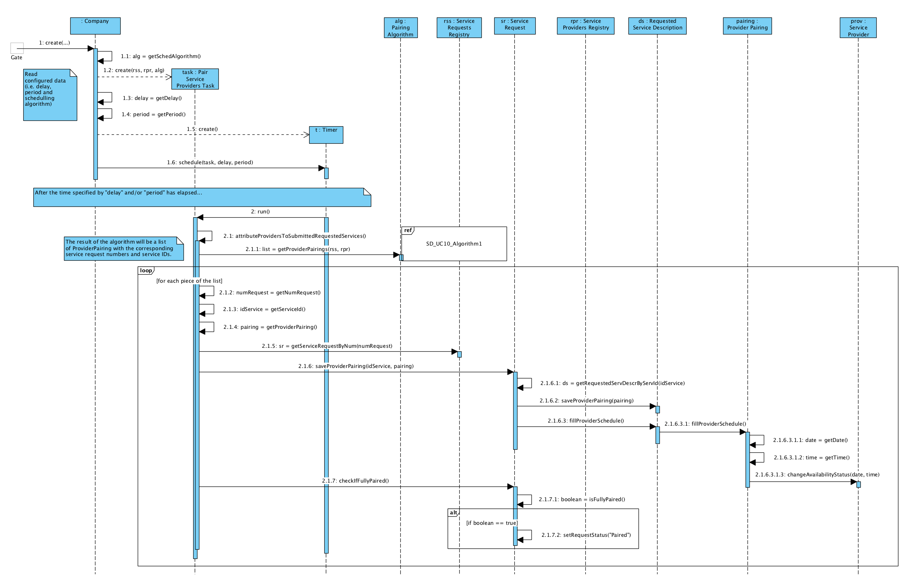
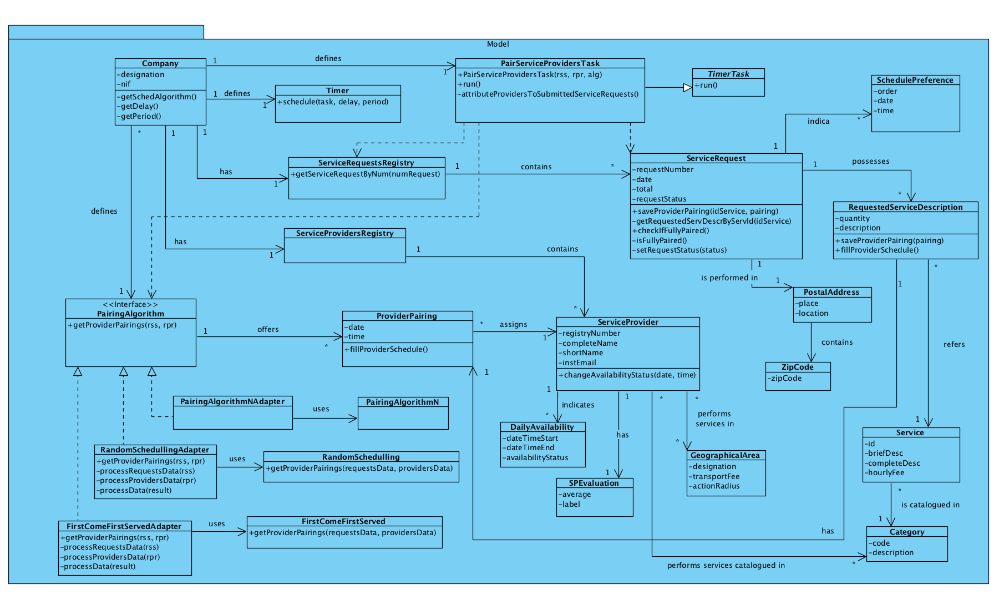

# Execution of UC10 - Attribute Service Providers to Service Requests

## Rationale

| Basic Flow | Question: Which Class... | Answer | Justification |
|:-------------------------------------------------------------------------------------------------------|:------------------------------------------------------------|:-----------------------------------------------|:---------------------------------------------------------------------------------------------------------------------|
| 1. Time signals the system to initiate a periodic process to allocate providers to service requests (in a submitted state). The process applies the suggestions of one scheduling algorithm (among several) defined by configuration. | ...controls the time? | Timer | Pure Fabrication: use of a Timer (scheduler) - it is not justified to attribute this responsibility to any existing class in the Domain Model (DM). |
|| ...creates the Timer? | Company ||
|| ...coordinates the process triggered by the Timer? | PairServiceProvidersTask | Pure Fabrication: the use of a Timer is based on its association with a class that "extends" the TimerTask class. |
|| ...has the necessary data for the execution of the process? | ServiceRequestsRegistry | Information Expert (IE) + HC + LC (over Company): in the DM, the Company has Service Requests, which have other necessary data. |
||| ServiceProvidersRegistry | IE + HC + LC (over Company): in the DM, the Company has Service Providers, which have other necessary data. |
|| ...knows the state of the service request? | ServiceRequest | IE: in the DM, ServiceRequest knows its own request status. |
|| ...provides the pairings between service providers and service requests? | PairingAlgorithm | IE: in the DM, PairingAlgorithm offers that information. | 
|| What is the expected result of the PairingAlgorithm? | ProviderPairing | IE: in the DM, PairingAlgorithm offers ProviderPairing. |
|| ...knows the PairingAlgorithm? | Company | IE: in the DM, Company defines PairingAlgorithm. Protected Variation over PairingAlgorithm in order to support various pairing algorithms. |
|| ...implements the particularities of each pairing algorithm? | PairingAlgorithmXXXAdapter | Protected Variation + Adapter |
|| ...saves the ProviderPairing? | RequestedServiceDescription | IE: in the DM, RequestedServiceDescription has one ProviderPairing. |

## Systematization ##

From the rationale, we get that the conceptual classes promoted to software classes are:

 * Company
 * PairingAlgorithm
 * ProviderPairing
 * ServiceProvider
 * ServiceRequest
 * RequestedServiceDescription

Other software classes (i.e. Pure Fabrication) identified:

 * Timer
 * PairServiceProvidersTask
 * ServiceRequestsRegistry
 * ServiceProvidersRegistry

##	Sequence Diagram

##	Class Diagram

