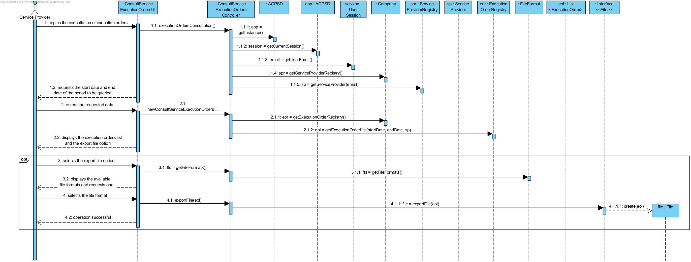
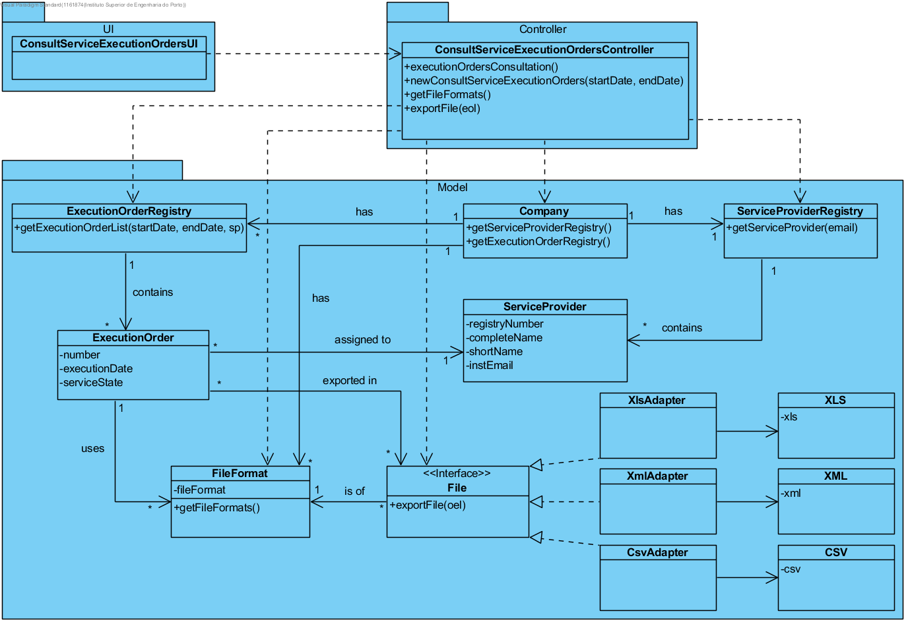

# Execution of UC12 - Consult Service Execution Orders

## Rationale

| Basic Flow | Question: Which Class... | Answer | Justification |
|:-------------------------------------------------------------------------------------------------------|:------------------------------------------------------------|:-----------------------------------------------|:---------------------------------------------------------------------------------------------------------------------|
|1. The service provider begins the consultation of execution orders.|...interacts with the user?| ConsultServiceExecutionOrdersUI | Pure Fabrication |
||...coordinates the UC?| ConsultServiceExecutionOrdersController | Controller |
||...knows the ExecutionOrder class?| ExecutionOrderRegistry | HC + LC |
||...knows the ExecutionOrderRegistry class?| Company | HC + LC - The Company delegates it's responsibility (earned by applying Creator - Rule 1) to ExecutionOrderRegistry by applying HC+LC.|
|2. The system requests the start date and end date of the period to be queried.| | | |
|3. The service provider enters the requested data.|...saves the inserted data?| ExecutionOrderRegistry | Information Expert (IE) - The execution orders are assigned to ServiceProvider. |
|4. The system displays the execution orders list and the export file option.|...knows the service provider's execution orders?| ExecutionOrderRegistry | IE - Company issues ExecutionOrder and the execution orders are assigned to ServiceProvider. By applying HC+LC the task is delegated to ExecutionOrderRegistry.|
|5. The service provider selects the export file option.|...interacts with the user?| ConsultServiceExecutionOrdersUI | Pure Fabrication |
||...coordinates the UC?| ConsultServiceExecutionOrdersController | Controller |
|6. The system displays the available file formats and requests one.|...knows the available file formats?| FileType | IE - FileFormat knows all available file formats. |
|7. The service provider selects the file format.|...saves the file format selected?|  File | IE - the File is of a format - created instance of file. |
|8. The system informs the service provider of the operation success.|...exports the created file?| File | IE - File has the selected file's format. |

## Systematization

The conceptual classes promoted to software classes in result of the rationale are:

 * Company
 * ServiceProvider
 * ExecutionOrder
 * File
 * FileFormat

Other identified software classes (i.e. Pure Fabrication): 

 * ConsultServiceExecutionOrdersUI
 * ConsultServiceExecutionOrdersController
 * ServiceProviderRegistry
 * ExecutionOrderRegistry

##	Sequence Diagram

##	Class Diagram

