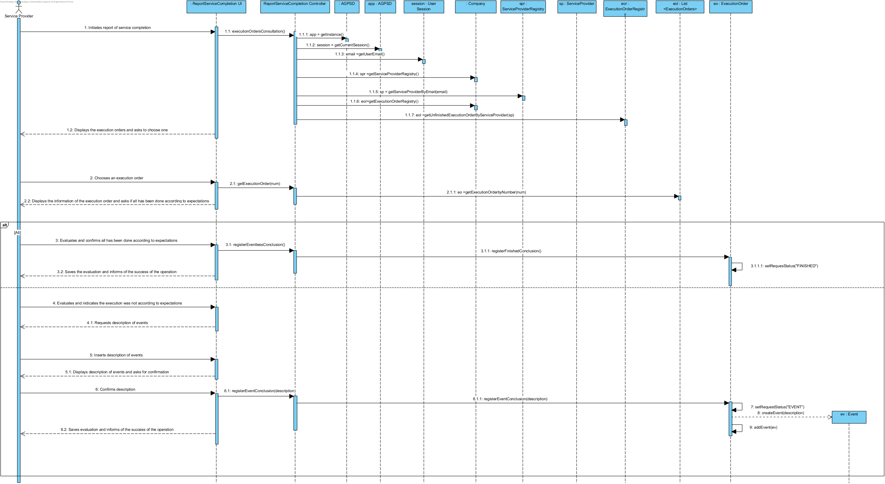
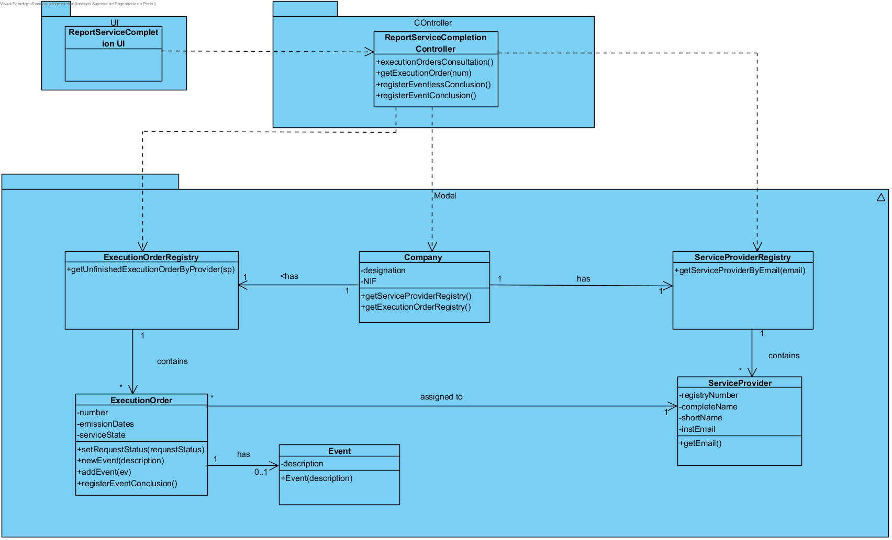

# Execution of UC13 - Report Service Conclusion

## Rationale

| Basic Flow | Question: Which Class... | Answer | Justification |
|:-------------------------------------------------------------------------------------------------------|:------------------------------------------------------------|:-----------------------------------------------|:---------------------------------------------------------------------------------------------------------------------|
|The service provider begins the report of conclusion of services.|...interacts with the user?| ReportServiceConclusionUI | Pure Fabrication |
||...coordinates the UC?| ReportServiceConclusionController | Controller |
||...knows the ServiceProvider class?| ServiceProviderRegistry | HC + LC |
||...knows the ServiceProviderRegistry class?| Company | HC + LC - The Company delegates it's responsibility (earned by applying Creator - Rule 1) to ServiceProviderRegistry by applying HC+LC.|
|2. The system displays the execution order list and asks the Service Provider to choose one.|...knows the ExecutionOrder class?| ExecutionOrderRegistry  |HC + LC  | |
||...knows the ExecutionOrderRegistry class?| Company | HC + LC - The Company delegates it's responsibility (earned by applying Creator - Rule 1) to ExecutionOrderRegistry by applying HC+LC.|
|3. The service provider selects the execution order.|...knows the Execution Orders?| ExecutionOrderList | Information Expert (IE) - The execution orders list is assigned to ServiceProvider. |
||...knows the ExecutionOrder list?| Service provider |Information Expert (IE) - The execution orders list is assigned to ServiceProvider.|
||...knows the Execution Orders ?| ExecutionOrderRegistry | HC + LC - The Company delegates it's responsibility (earned by applying Creator - Rule 1) to ExecutionOrderRegistry by applying HC+LC.|
|4. The system validates, displays the execution order and asks the Service Provider to confirm if all has been according to expectations.|...interacts with the user?| ReportServiceConclusionUI | Pure fabrication |
|5. The service provider confirms or states there was an unexpected event.|...saves the inserted status?| Execution Order | |
|6. The system saves the information about the conclusion and saves the description of the event in case there is one.|...knows the  service provider's execution orders? | ServiceProvider | IE - ServiceProvider knows all his ExecutionOrder.|
||...saves the description?| Event | IE: Information Expert |
||...instanciates Event?| Execution Order | Creator (rule4) |
|7. The system informs the service provider of the operation success.| | | |

## Systematization

The conceptual classes promoted to software classes in result of the rationale are:

 * Company
 * ServiceProvider
 * ExecutionOrder

Other identified software classes (i.e. Pure Fabrication): 

 * ReportServiceConclusionUI
 * ReportServiceConclusionController
 * ServiceProviderRegistry
 * ExecutionOrderRegistry

##	Sequence Diagram

##	Class Diagram

