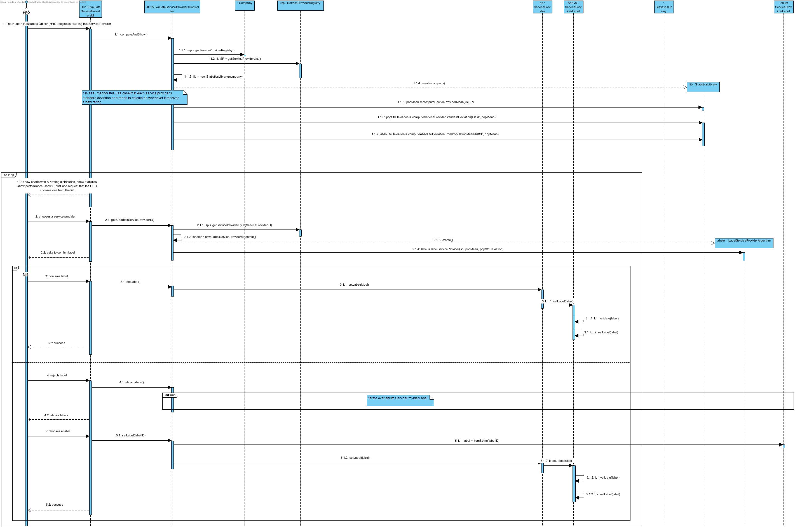
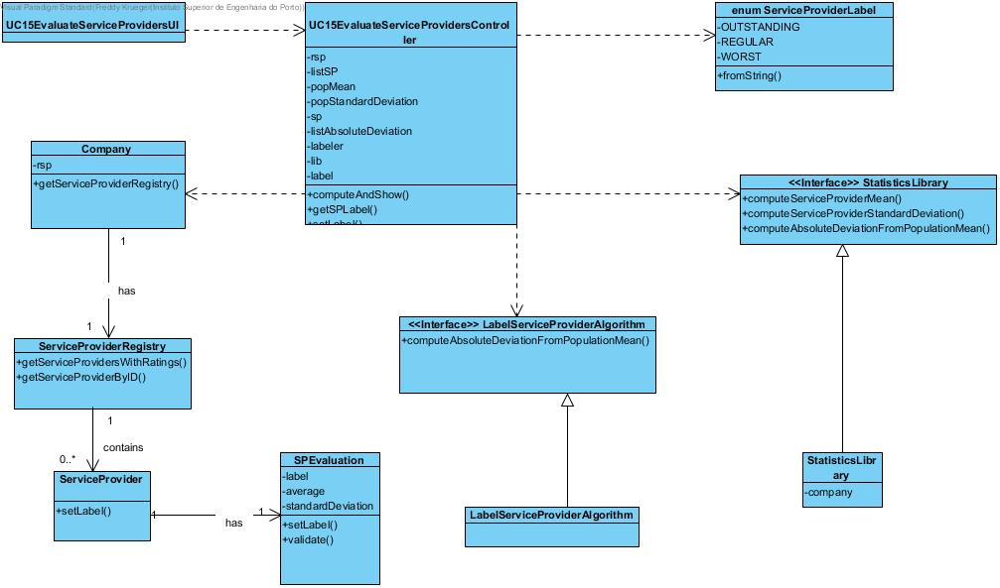

# Execution of UC15 Evaluate Service Providers

## Rationale

| Main Flow | Question: Which Class... | Answer | Justification |
|:-------------------------------------------------------------------------------------------------------|:------------------------------------------------------------|:-----------------------------------------------|:---------------------------------------------------------------------------------------------------------------------|
|1. The Human Resources Officer (HRO) begins evaluating the Service Provider | ...interacts with the HRO? | UC15EvaluateServiceProvidersUI | PureFabrication |
|| ...controls the use case? | UC15EvaluateServiceProvidersController | PureFabrication |
|2. The system computes all of the required statistics for the ratings such as: mean (for the population), standard deviation (for the population), the absolute differences between the average ratings of each service provider and the mean rating of all service providers, and labels. Then the system shows the HRO a chart with the histogram showing SP rating distribution, the statistics and shows the service provider list and asks for one | ...has the ServiceProviders? | ServiceProviderRegistry | IE + HC/LC |
|| ...computes the population mean | StatisticsLibrary | PureFabrication - External algorithm has been assigned responsability |
|| ...computes the population standard deviation | StatisticsLibrary | PureFabrication - External algorithm has been assigned responsability |
|| ...computes the absolute differences between the average ratings of each service provider and the mean rating of all service providers? | StatisticsLibrary | PureFabrication - External algorithm has been assigned responsability |
|3. The HRO chooses one ||||
|4. The system computes and provides the computed label and asks to confirm it | LabelServiceProviderAlgorithm | PureFabrication - In the future it may be desired to label ServiceProvider in a different way, or have several ways to do it and choose from, best to assign it to a seperate algorithm |
|5. The HRO confirms | ...stores the computed label? | ServiceProviderEvaluation | IE |
||... validates the computed label? | ServiceProviderEvaluation | IE |
|6. The system confirms the success ||||
|7. Alternatively, the HRO rejects the label||||
|8. The system shows the HRO a list of the possible labels | ...knows which labels exist? | An enum class ServiceProviderLabel | IE - labels are more cleanly implemented as enums |
|9. The HRO chooses one |...stores the computed label? | ServiceProviderEvaluation | IE |
||... validates the computed label? | ServiceProviderEvaluation | IE |
|10. The system confirms the success ||||
|11. Steps 2 through 10 repeat themselves while the HRO wishes to label Service Providers ||||

## Systematization ##

The conceptual classes promoted to software classes in result of the rationale are:

 * ServiceProvider 
 * ServiceProviderEvaluation
 * Company

Other identified Software classes (i.e. Pure Fabrication):  

 * UC15EvaluateServiceProvidersUI  
 * UC15EvaluateServiceProvidersController
 * StatisticsLibrary
 * ServiceProviderLabel
 * LabelServiceProviderAlgorithm

##	Sequence Diagram

##	Class Diagram

