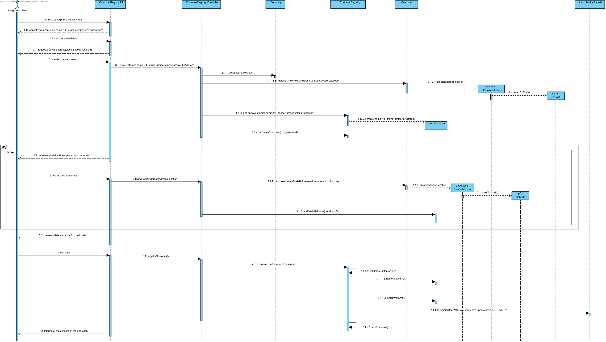
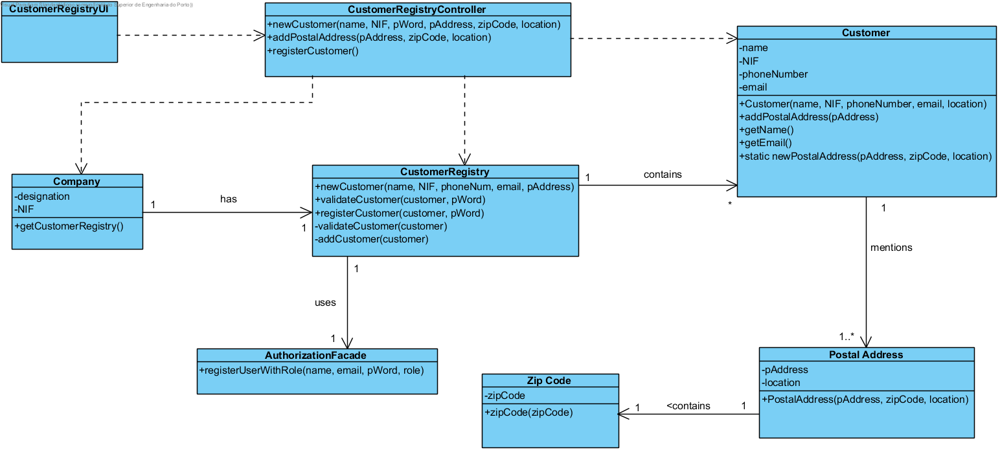

# Execution of UC1 Performs Customer Registry

## Rationale

| Main Flow | Question: Which Class... | Answer | Justification |
|:-------------------------------------------------------------------------------------------------------|:------------------------------------------------------------|:-----------------------------------------------|:---------------------------------------------------------------------------------------------------------------------|
|1. The Unregistered user initiates the registry as a Customer.|... interacts with the user?|CustomerRegistryUI|PureFabrication|
||...coordinates the UC?|CustomerRegistryController|Controller|
||...creates/instanciates Customer?|Customerregistry| HC + LC (on Company) + Creator (Rule 1)|
||...who know the CustomerRegistry?|Company| HC + LC |
|2. The system requests the necessary data (i.e. complete name,  NIF, phone number, email and password).| | | |
|3. The unregistered user inserts the requested data.| ... saves the requested data?|Costumer|Information Expert (IE) - instance created on step 1|
|4. The system requests a postal address.||||
|5. The unregistered user inserts the postal address.|...creates/instanciates Postal Address?|Customer|Creator (Rule 4)|
|| ... saves the inserted data?| Postal Address|Information Expert (IE) - instance created on this step|
|||ZipCode| IE: a Postal Address has a Zip Code|
|6. The system validates and saves the inserted postal address.|... saves and instanciates the Postal Address?| Customer|Information Expert (IE) -In the Dm the Customer has one or more Postal Addresse(s)|
|7. The steps 4 to 6 repeat themselves until the Unregistered User saves all the addresses he wishes (minimum 1).||||
|8. The system validates and presents the information for confirmation.|...validates Customer data (local validation)?|Customer|IE: Customer posesses their own data|
||...validates the Customer data (global validation)?|CustomerRegistry|IE: The CustomerRegsitry contains/gathers Customers|
|9. The Unregistered User confirms. ||||
|10. The system saves the Customer and Registered User data and indicates the success of the operation.|...saves the registered Customer?|CustomerRegistry|IE. the CustomerRegistry contains/gathers Services|
|| ... saves this Customer's user data?  | AuthorizationFacade | IE. The Customer management is made through the external service represented in the class "AuthorizationFacade" |   
|| ... notifies the user?  | CustomerRegistryUI | |                                               

## Systematization ##

The conceptual classes promoted to software classes in result of the rationale are:

 * Company
 * Postal Address
 * Zip Code
 * Customer
 * CustomerRegistry

Other identified Software classes (i.e. Pure Fabrication):  

 * CustomerRegistryUI  
 * CustomerRegistryController

**Note:** 
The responsability of instanciating the Postal Address instances has been assigned to the Customer.
However, a customer is only valid when there is at least one Postal Address assigned to him.
So, in order to have a Customer, it is mandatory for a Postal Address to exist.
Like this it is not possible to request an instance of Customer to create a Postal Address.
In order to solve this matter, the creation of instances of Postal Address is made through a static method in the class Customer, This way it is not mandatory for there to be a previous instance of Customer.

##	Sequence Diagram

##	Class Diagram

