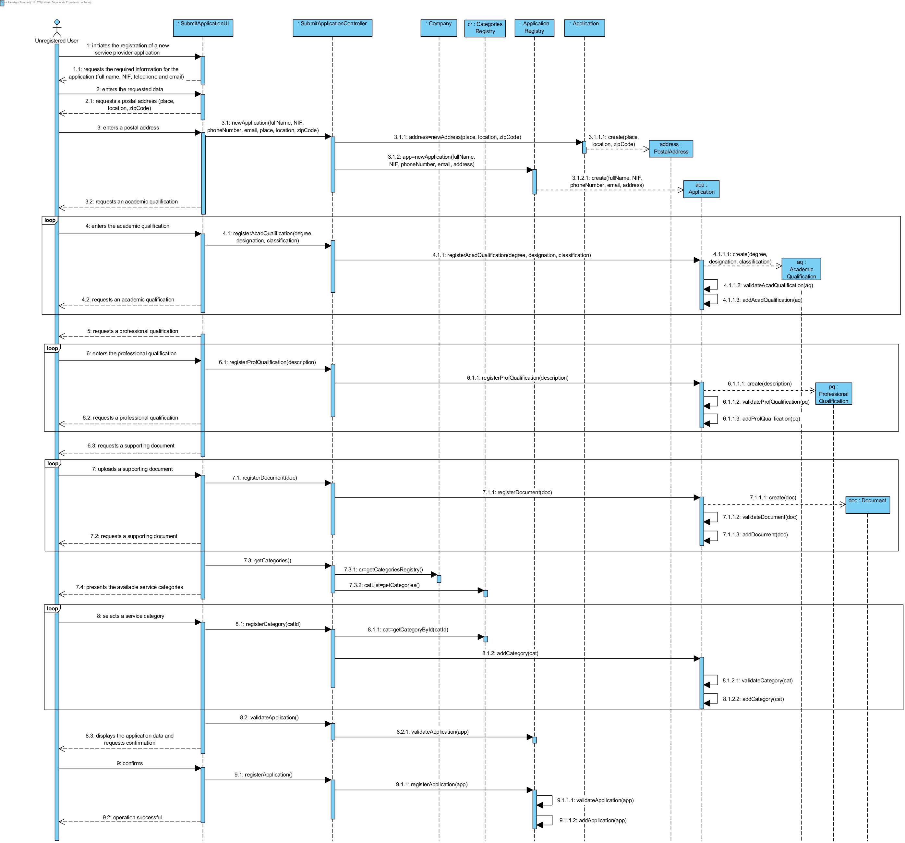
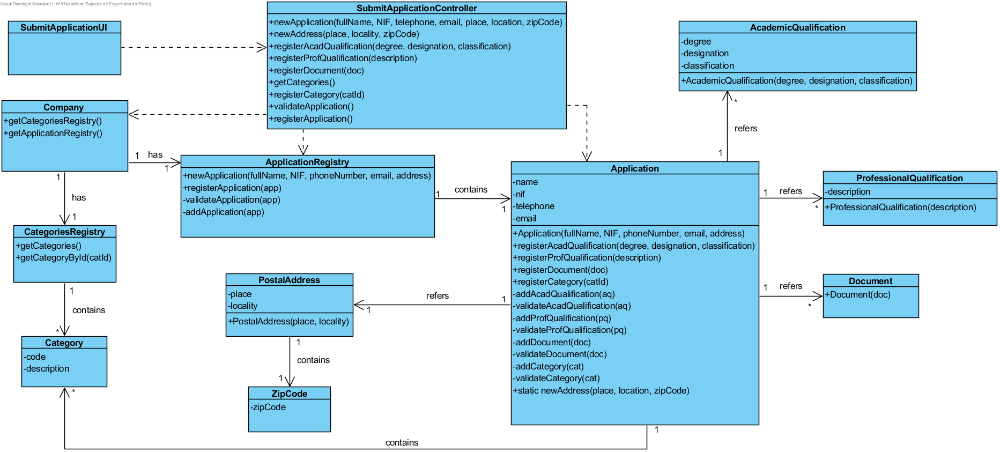

# Execution of UC2 - Submit Service Provider Application

## Rationale

| Main Flow | Question: Which Class... | Answer | Justification |
|:-------------------------------------------------------------------------------------------------------|:------------------------------------------------------------|:-----------------------------------------------|:---------------------------------------------------------------------------------------------------------------------|
| 1. The unregistered user initiates the registration of a new service provider application. | ...interacts with the user? | SubmitApplicationUI | PureFabrication |
|| ...coordinates the UC?  | SubmitApplicationController | Controller |
|| ...creates/instantiates the Application? | ApplicationRegistry | The Company delegates it's responsibility (earned by applying Creator - Rule 1) to ApplicationRegistry by applying HC+LC. |
| 2. The system requests the required information for the application (full name, NIF, telephone and email). | | | |
| 3. The unregistered user enters the requested data. | ...saves the inserted data? | Application | Information Expert (IE) - instance created in step 1. |
| 4. The system requests a postal address. | | | |
| 5. The unregistered user enters a postal address. | ...creates/instantiates PostalAddress? | Application | Creator (Rule 4). |
|| ...saves the inserted data? | PostalAddress | IE - instance created in this step. |
| 6. The system validates and saves the entered postal address. | ...saves the created PostalAddress instance? | Application | IE |
| 7. The system requests an academic qualification. | | |
| 8. The unregistered user enters the academic qualification. | ...creates/instantiates AcademicQualification? | Application | Creator (Rule 1). |
|| ...saves the inserted data? | AcademicQualification | IE - instance created in this step. |
| 9. The system validates and saves the academic qualification. | ...saves the created AcademicQualification instance? | Application | IE - Application refers academic qualifications in the DM. |
| 10. Steps 8 to 10 are repeated until all academic qualifications have been entered. | | | |
| 11. The system requests a professional qualification. | | | |
| 12. The unregistered user enters the professional qualification. | ...creates/instantiates ProfessionalQualification? | Application | Creator (Rule 1). |
| | ...saves the inserted data? | ProfessionalQualification | IE - instance created in this step. |
| 13. The system validates and saves the professional qualification. | ...saves the created ProfessionalQualification instance? | Application | IE - Application refers professional qualifications in the DM. |
| 14. Steps 12 to 14 are repeated until all the professional qualifications have been entered. | | | |
| 15. The system requests a supporting document. | | | |
| 16. The unregistered user uploads a supporting document. | ...creates/instantiates Document? | Application | Creator (Rule 1). |
|| ...saves the inserted data? | Document | IE - instance created in this step. |
| 17. The system validates and saves the supporting document. | ...saves the created Document instance? | Application | IE - Application refers supporting documents in the DM. |
| 18. Steps 16 to 18 are repeated until all supporting documents have been uploaded. | | | |
| 19. The system presents the service categories available in the system. | ...knows the existing categories to be listed? | CategoriesRegistry | IE: CategoriesRegistry has/aggregates all Categories. |
| 20. The unregistered user selects the service category(ies) of the service(s) that he proposes to perform. | | |
| 21. The system validates and saves the selected category. | ...saves the selected category? | Application | IE - Application refers categories in the DM. |
| 22. Steps 20 to 22 are repeated until all the categories have been entered. | | | |
| 23. The system validates, displays the application data to the unregistered user and requests his confirmation. | ...validates the Application data (local validation) | Application | IE - Application knows its own data. |
|| ...validates the Application data (global validation) | ApplicationRegistry | IE - The Company contains/aggregates Application and delegates to ApplicationRegistry (HC+LC).
| 24. The unregistered user confirms the application data. | | | |
| 25. The system registers the new application and informs the unregistered user of the operation success. | ...saves the specified/created Application? | ApplicationRegistry | IE – ApplicationRegistry contains/aggregates Application in the DM. |
|| ...informs the unregistered user? | SubmitApplicationUI | |

## Systematization ##

The conceptual classes promoted to software classes in result of the rationale are:

* Company
* PostalAddress
* Application
* AcademicQualification
* ProfessionalQualification
* Document 

Other identified software classes (i.e. Pure Fabrication):

* SubmitApplicationUI
* SubmitApplicationController
* ApplicationRegistry
* CategoriesRegistry

## Sequence Diagram

## Class Diagram

