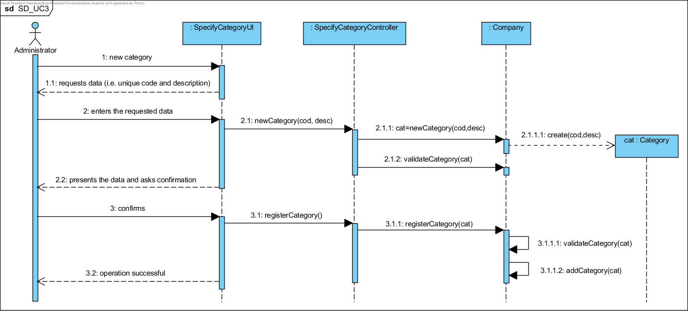
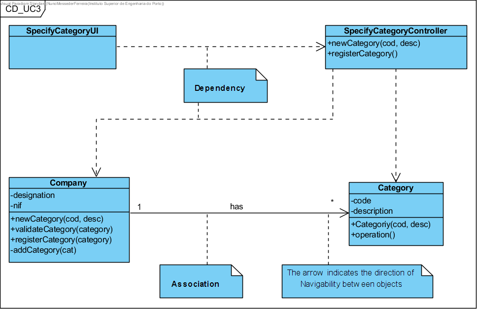

# Execution of UC3 Specify Category

## Rationale

| Main Flow | Question: Which Class... | Answer | Justification |
|:-------------------------------------------------------------------------------------------------------|:------------------------------------------------------------|:-----------------------------------------------|:---------------------------------------------------------------------------------------------------------------------|
| 1. The administrator starts specifying a new category. | ... interacts with the user? | SpecifyCategoryUI.                          | Pure Fabrication, as it is not justified to assign this responsibility to any class in the Domain Model. |
|| ... coordinates the CU? | SpecifyCategoryController | Controller. |  |
|| ... creates/instates Category? | Company | Creator (Rule 1) | | |
| 2. The system requests the necessary data (i.e. unique code and description). | | | |
| 3. The administrative person enters the requested data. | ... saves the entered data? | Category | Information Expert (IE) - instance created in step 1 |
| 4. The system validates and presents the data to the administrator, asking him to confirm them. | ... validates the data of the Category (local validation)? | Category | IE: Category has its own data | ...
|| ... validates the Category data (global validation)? | Company | IE: The Company contains / aggregates Categories | | |
| 5. The administration confirms this.                                                                     | | | |
| 6. The system records the data and informs the administrative of the success of the operation. |... stores the specified/created Category? | Company | IE. The Company contains/aggregates Categories in the DM |
|| ... notifies the user? | SpecifyCategoryUI | | | 

## Systematization ##

 From the rational it follows that the conceptual classes promoted to software classes are:

 * Company
 * Category

Other software classes (i.e. Pure Fabrication) identified:  

 * SpecifyCategoryUI   
 * SpecifyControllerCategory

## Sequence Diagram

This approach considers that the **"get "** and **"set "** methods should be avoided/minimised (see [here](https://www.javaworld.com/article/2073723/core-java/why-getter-and-setter-methods-are-evil.html)).

This alternative implies the existence of a manufacturer with parameters in Category.
Therefore, it is not necessary to use the **"set "** methods.
The existing set methods will be deprived of the class Category.

This alternative also assumes that the objects:

* when they are created are immediately valid (otherwise an exception would occur);
* only accept modifications to their current state leading to another valid state.

Thus, it is not necessary to validate locally the category object created. However, the company continues to perform global validations (e.g. there are no duplicates).

## Class Diagram

The class diagram shown is in accordance with the above sequence diagram.

