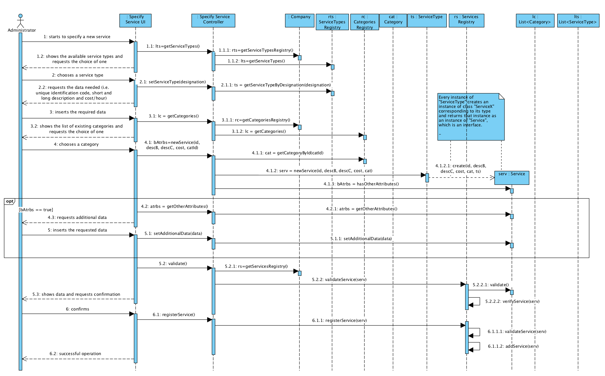
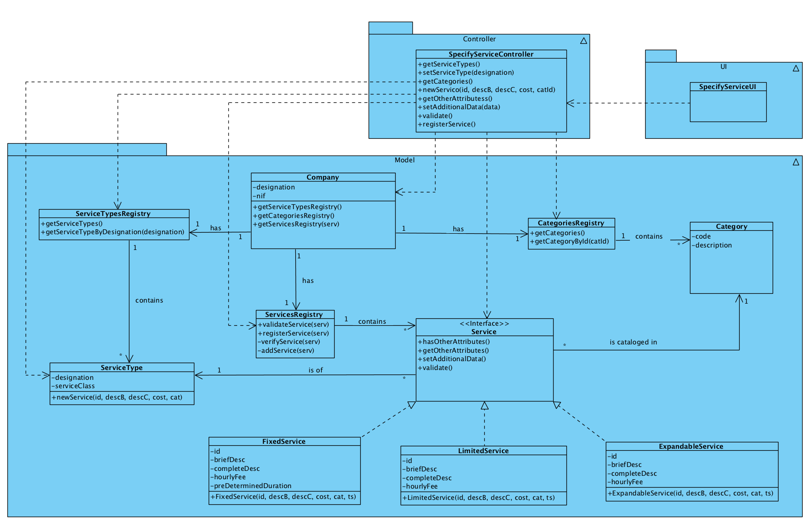

# Execution of UC4 - Specify Service

## Rationale

| Basic Flow | Question: Which Class... | Answer | Justification |
|:-------------------------------------------------------------------------------------------------------|:------------------------------------------------------------|:-----------------------------------------------|:---------------------------------------------------------------------------------------------------------------------|
| 1. The administrator starts to specify a new service. | ...interacts with the user? | SpecifyServiceUI | PureFabrication |
|| ...coordinates the UC? | SpecifyServiceController | Controller |
|| ...creates/instantiates Service? | ServiceType | Through the application of the Creator pattern (R1), it should be the Company. But, through the application of HC + LC, the Company would delegate that task to ServicesRegistry. However, the Service to create depends on its type. And it is the ServiceType who knows the class related to the service type to be created is the class ServiceType. |
| 2. The system shows the available service types and requests the choice of one. | ...knows the service types available? | ServiceTypesRegistry | Information Expert (IE): in the Domain Model (DM) the Company has ServiceType. Through the application of HC + LC, it delegates the task to ServiceTypesRegistry. |
| 3. The administrator chooses the service type wanted. | ...saves the service type selected? | Service | IE: the Service is of a type - created instance of service. |
| 4. The system requests the data needed (i.e. unique identification code, short and long description and cost/hour). ||||
| 5. The administrator inserts the required data. | ...saves the inserted data? | Service | IE: instance previously creted |
| 6. The system shows the list of existing categories and requests the choice of one. | ...knows the existing categories? | CategoriesRegistry | IE: the Company has/aggregates every Category and through the application of HC + LC it delegates this task to the CategoriesRegistry. |
| 7. The administrator chooses the category in which the service will be cataloged. | ...saves the selected category? | Service | IE: Service is cataloged in a Category |
| 8. The system requests additional data if the service type requires it. | ...knows if additional data is required? | Service | IE: instance previously created |
| 9. The administrator inserts the requested data. | ...saves the additional data? | Service | IE: instance previously created | 
| 10.  The system validates and presents the data to the administrator, requesting confirmation. | ...validates the data of the Service (local validation)? | Service | IE: Service has its own data | 
|| ...validates the data of the Service (global validation)? | ServicesRegistry | IE: the Company has/aggregates Services and delegates it to ServicesRegistry (HC + LC) |
| 11. The administrator confirms. ||||
| 12. The systems registers the data and informs the administrator about the success of the operation. | ...saves the created Service? | ServicesRegistry | IE: in the DM, the Company has/aggregates Services and delegates it to the ServicesRegistry (HC + LC) |
|| ...notifies the user? | SpecifyServiceUI ||

## Systematization

From the rationale, we get that the conceptual classes promoted to software classes are:

 * Company
 * ServiceType
 * Service
 * Category

Other software classes (i.e. Pure Fabrication) identified:

 * SpecifyServiceUI
 * SpecifyServiceController
 * ServiceTypesRegistry
 * ServicesRegistry
 * CategoriesRegistry

##	Sequence Diagram

##	Class Diagram

