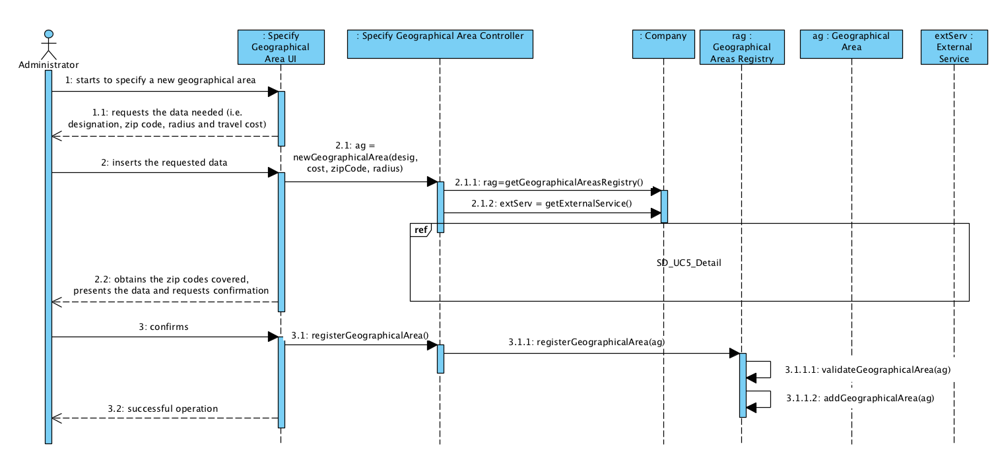
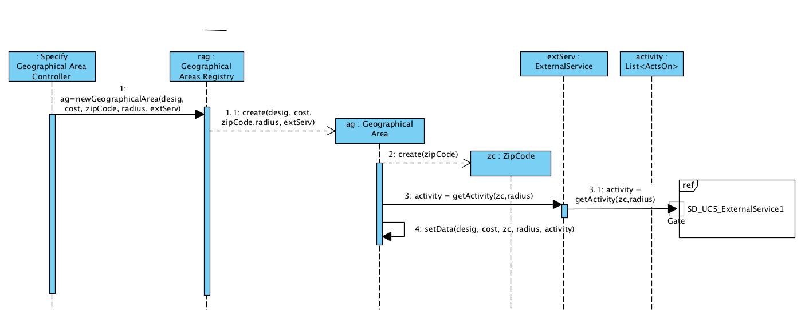
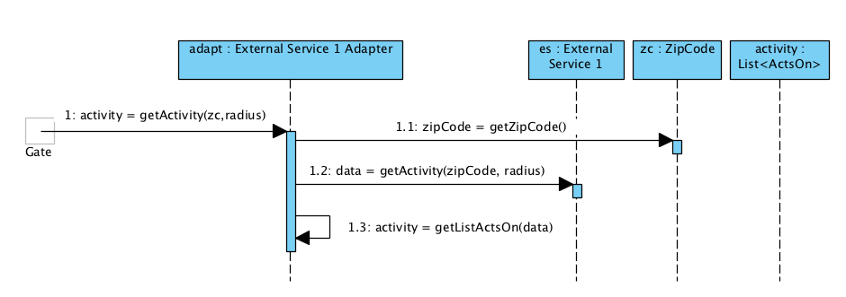
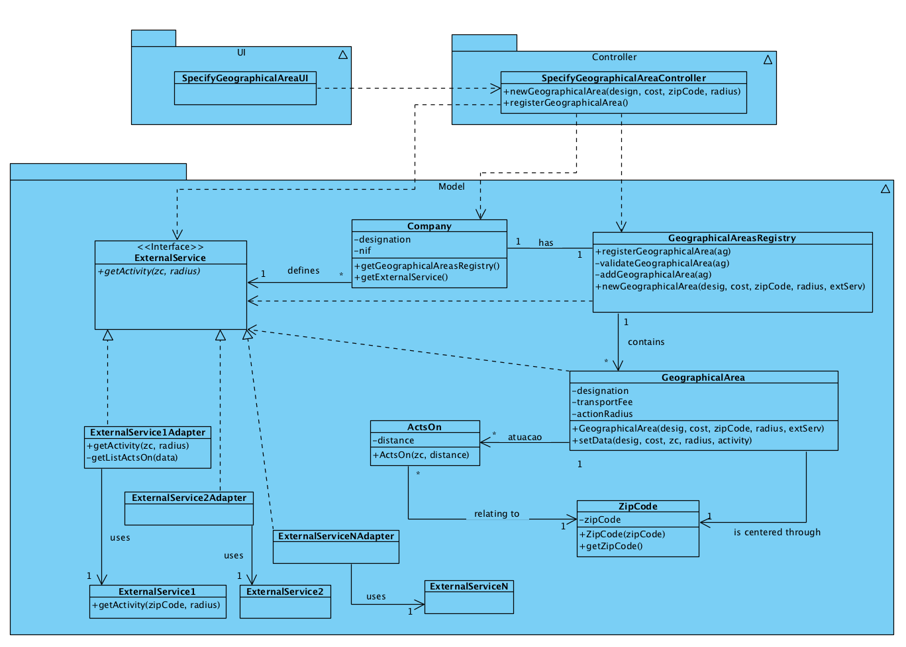

# Execution of UC5 - Specify Geographical Area

## Rationale

| Basic Flow | Question: Which Class... | Answer | Justification |
|:-------------------------------------------------------------------------------------------------------|:------------------------------------------------------------|:-----------------------------------------------|:---------------------------------------------------------------------------------------------------------------------|
| 1. The administrator starts to specify a new geographical area. | ...interacts with the user? | SpecifyGeographicalAreaUI | PureFabrication, as it is not justifiable for any other Domain Model (DM) class to have that responsibility. |
|| ...coordinates the UC? | SpecifyGeographicalAreaController | Controller |
|| ...creates/instantiates Geographical Area? | GeographicalAreaRegistry | Creator (Rule 1) + HC + LC: the Company delegates this task to GeographicalAreaRegistry. |
| 2. The system requests the data needed (i.e. designation, zip code, radius and travel cost). |||| 
| 3. The administrator inserts the requested data. | ...saves the data? | Geographical Area | Information Expert (IE): instance created in step 1 |
| 4. The system obtains the zip codes covered by the new geographical area, validates and presents the data to the administrator, requesting confirmation. | ...validates the data of the Geographical Area (local validation)? | Geographical Area | IE: in the DM, Geographical Area has its own data. |
|| ...validates the data of the Geographical Area (global validation)? | GeographicalAreaRegistry | IE + HC + LC: GeographicalAreaRegistry contains/aggregates Geographical Areas. |
|| ...provides postal addresses within a range of action? | ExternalService | IE: in the DM, ExternalService provides that information. |
|| What is the expected result of the External Service? | List<ActsOn> | IE: in the DM, ExternalService provides various "ActsOn". |
|| ...knows the External Service? | Company | IE: in the DM, Company defines ExternalService. Protected Variation should be used over ExternalService because the system should support various external services. |
|| ...implements the particularities of each concrete external service? | ExternalServiceXXXAdapter | Protected Variation + Adapter |
| 5. The administrator confirms. ||||
| 6. The system registers the new geographical area and informs the administrator about the success of the procedure. | ...saves the geographical area created? | Company | IE: in the DM, the Company acts in various geographical areas. |
|| ...notifies the user? | SpecifyGeographicalAreaUI || 

## Systematization

 From the rationale, we get that the conceptual classes promoted to software classes are:

 * Company
 * GeographicalArea
 * ExternalService
 * ActsOn

Other software classes (i.e. Pure Fabrication) identified: 

 * SpecifyGeographicalAreaUI  
 * SpecifyGeographicalAreaController
 * GeographicalAreaRegistry

##	Sequence Diagram

### Base Solution

**This base solution is complemented/detailed with the diagram presented below. _"Interaction Use"_ was applied so that the Sequence Diagram references the diagram that details/completes it.**

### Detail

**ExternalService is an interface implemented by the ExternalServiceAdapters. Therefore, the method getActivity(zc, radius) will get redirected to the adapter of the external service defined by configuration. Next follows the diagrams representing what happens with each one of the used external services.**

**Note:** For now only one external service is considered. 

#### External Service 1

##	Class Diagram

