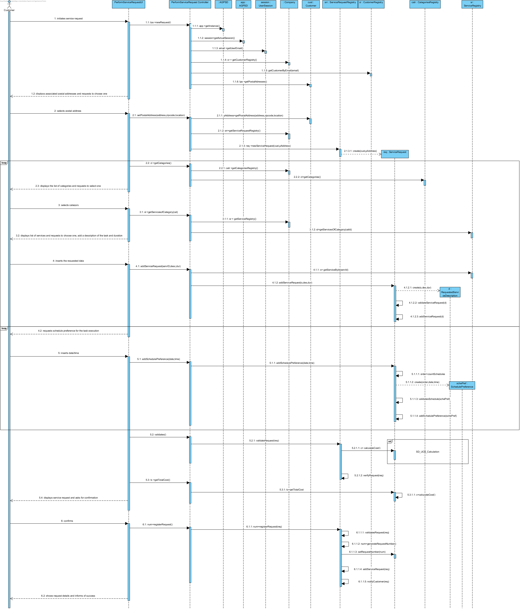
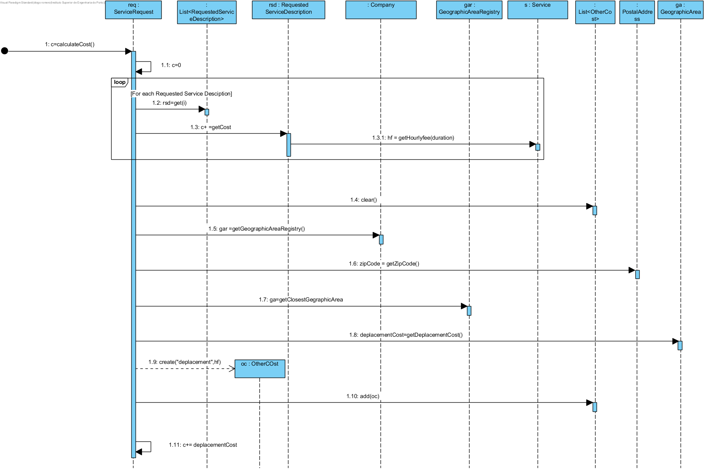
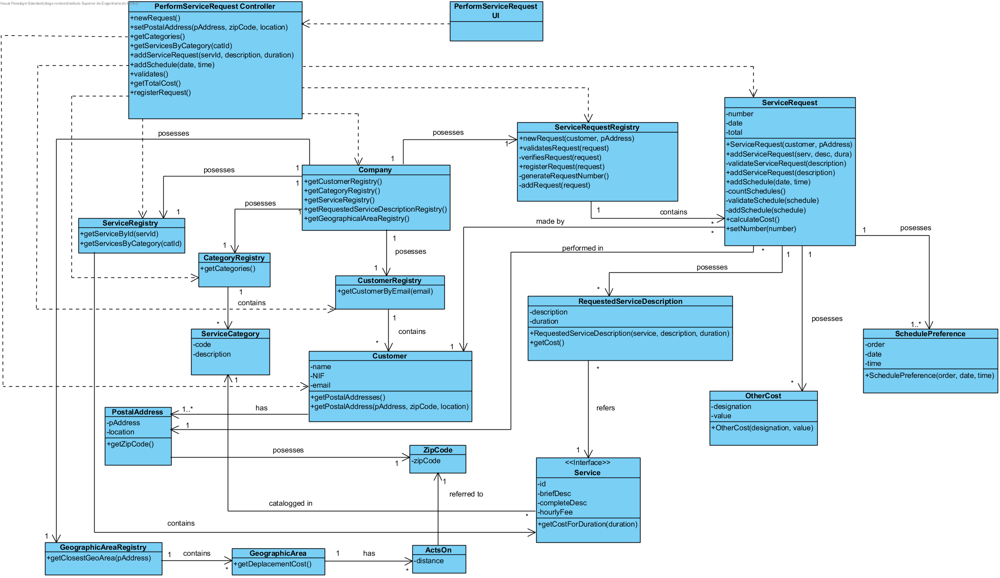

# Execution of the UC6 Performs a Service Request

## Rationale

| Main Flow | Question: Which Class... | Answer | Justification |
|:-------------------------------------------------------------------------------------------------------|:------------------------------------------------------------|:-----------------------------------------------|:---------------------------------------------------------------------------------------------------------------------|
|1. The Customer initiates the Service Request.  | ... interacts with the user? | PerformsServiceRequestUI | Pure Fabrication, since it is not justifiable to atribute this responsability to a Domain class. |
|| ... coordeninates the UC? | PerformServiceRequestController | Controller | |
|| ... creates/instanciates Service Request? | ServiceRequestRegistry | Creator (rule 1) + HC +LC over Company| |
|2. The system displays the associated postal addresses and asks the Customer to choose one. |... knows the Customer's postal addresses? | Customer | IE: The Customer has one or more postal addresses |
|3. The Customer selects the desired Postal Address. | ... saves the selected Postal Address? | ServiceRequest|IE: Instance created before. In the DM the Service Request is performed in a Postal Address. |
|4. The system presents the categories of services and asks the Customer to choose one.|... knows the existing categories? | CategoryRegistry | IE: CategoryRegistry posesses Category|
|5. The Costumer selects the desired category | | | |
|6. The system displays the services of that category, asking the Customer to select one of them and to add a representative description of the task to be executed and, in the case where the services allow to specify the duration of the task, also informs of the expected duration for the execution of the task. | ...knows the services of a certain category? | ServiceRegistry | IE: Serviceregistry knows all services. |
|||Service|IE: In the DM in the category where it is catalogged.|
|7. The Customer selects the desired service and inserts the description and the estimated duration.| |||
|8. The system validates and saves the inserted data. |...saves the introduced data?|RequestServiceDescription|IE:In the DM a Service request has several Requested Service Descriptions, with all these informations.|
||...creates/intanciates RequestedServiceDescription?|ServiceReques|Creator (rule 1)|
||...validates the data?(local validation)| RequestedServiceDescription |IE: it's their own data.|
||...validates the data?(global validation)| ServiceRequest |IE: knows all its Requested Service Descriptions.|
|9. Steps 4 to 8 repeat themselves until all services the Customer desires are specified. ||||
|10. The system requests the insertion of a preferred schedule (date and time of beginning) for the executon of the task.||||
|11. The Customer inserts the preferred schedule.|||| 
|12. The system validates and saves the preferred schedule.|...validates and saves the preferred schedule?|SchedulePreference|IE: it's the data of this concept.|
||| ServiceRequest |IE: in the DM the Service request has several Schedule Preferences |
||...creates/instanciates SchedulePreference?|ServiceRequest|Creator(rule 1)|
|13. The steps 10 to 12 repeat themselves until at least one schedule preference is defined.
|14. The system validates the request, calculating the estiamted cost e presenting the results in order for the Cutomer to confirm them. |... validates the Request?(local validation)|Servicerequest|IE: knows its own information.|
||...validates the request? (global validation)|ServiceRequestRegistry|IE: Service Request Registry knos all the Requests .|
||...calculates the total cost?|ServiceRequest|IE: cknows all the services requested and the postal addresses where they will take place.|
||| RequestedServiceDescription |IE: knows the duration of the requested service.|
||| Service |IE: knows its hourly cost.|
||...saves the deplacement cost?|OtherCost|IE: in the DM the RequestedServiceDescription has several other costs|
||...creates/instanciates OtherCost| ServiceRequest |Creator (rule 1)|
|15. The Customer confirms the request. 
|16. The system saves it, assigns it with a unique request number and presents it to the Customer as well as a success of operation message. | ... generates the request number? | ServiceRequestRegistry |IE.: knows all the requested services.|
||...saves the request number?|ServiceRequest|IE: previously created instance.|
||...saves the Request?| ServiceRequestRegistry |IE: ServiceRequestRegistry has all the Requests.|
||...notifies of the request number and information of success?| PerformServiceRequestUI ||

## Systematization ##

 From the rationale, we get that the conceptual classes promoted to software classes are:

 * Company
 * Customer
 * Service
 * Category
 * ServiceRequest
 * RequestedServiceDescription
 * SchedulePreference
 * OtherCost

Other identified Software classes (i.e. Pure Fabrication): 

 * PerformServiceRequestUI  
 * PerformServiceRequestController
 * CustomerRegistry
 * CategoryRegistry
 * ServiceRegistry
 * ServiceRequestRegistry
 * GeographicAreaRegistry

##	Sequence Diagram

##	Class Diagram

