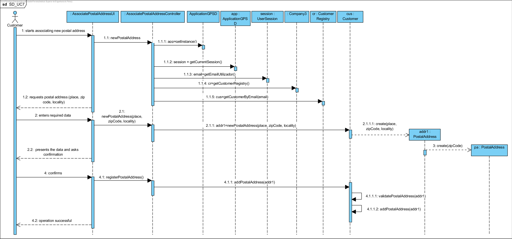
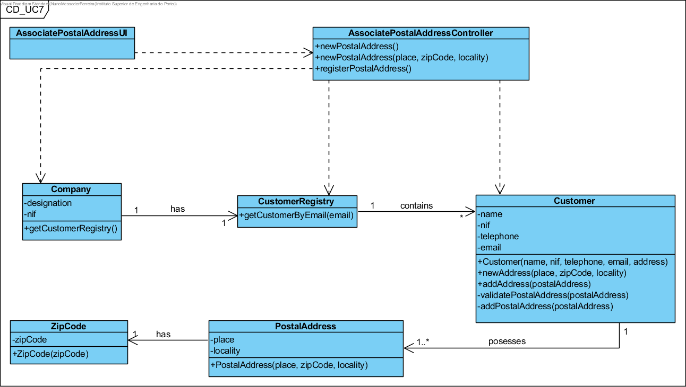

Realization of UC7 Associate Postal Address to Customer
==========================================

Rationale
--------

| Main Flow                                                               | Question: What class...                            | Answer | Justification |
|-------------------------------------------------------------------------------|----------------------------------------------------|----------------------------------|---------------------------------------------------------------------------------------------------------|
| 1. The customer starts associating a new postal address to his information. | ... Does it interact with the user?  AssociatePostalAddressUI | PureFabrication, as it is not justified to assign this responsibility to any class existing in the MD. |
| ...coordinates the UC? | AssociatePostalAddressController | Controller |
| 2. The system requests the necessary data (i.e. postal address).            | n/a | | | 
| 3. The Client enters the required data. | ... creates/ instantiates postal addresses? | Client | Creator (rule 4) |
| | ... saves the entered data? | PostalAddress | IE - instance created in step 1 |
|||Zip Code | IE. A Postal Address has a Zip Code
| 4. The system validates and presents the data, asking you to confirm them. | ...validates the address data (local validation)? | PostalAddress | IE: PostalAddress has its own data | |
| ...validates the Address data (global validation)? | Client | IE: Client contains/aggregates all its postal addresses.|
| 5. The Client will confirm.                                                        | | | |
| 6. The system associates the postal address to the customer and informs him of the success of the operation. | ...saves the created Postal Address? | Customer | IE: Customer contains/adds all his postal addresses. | | | ... Notifies the user? | AssociatePostalAddressUI | | 

Systematization
--------------

From the rational it follows that the conceptual classes promoted to software classes are:

- Company

- Customer

- PostalAddress 

- ZipCode

Other software classes (i.e. Pure Fabrication) identified:

- AssociatePostalAddressUI

- AssociatePostalAddressController

Sequence Diagram
---------------------

**Note:** It was not considered relevant to promote (by application of HC+LC) the list of Postal Addresses of a Client to a specific class of software. However, this could have been done and would have been perfectly valid.

Class Diagram
-------------------

