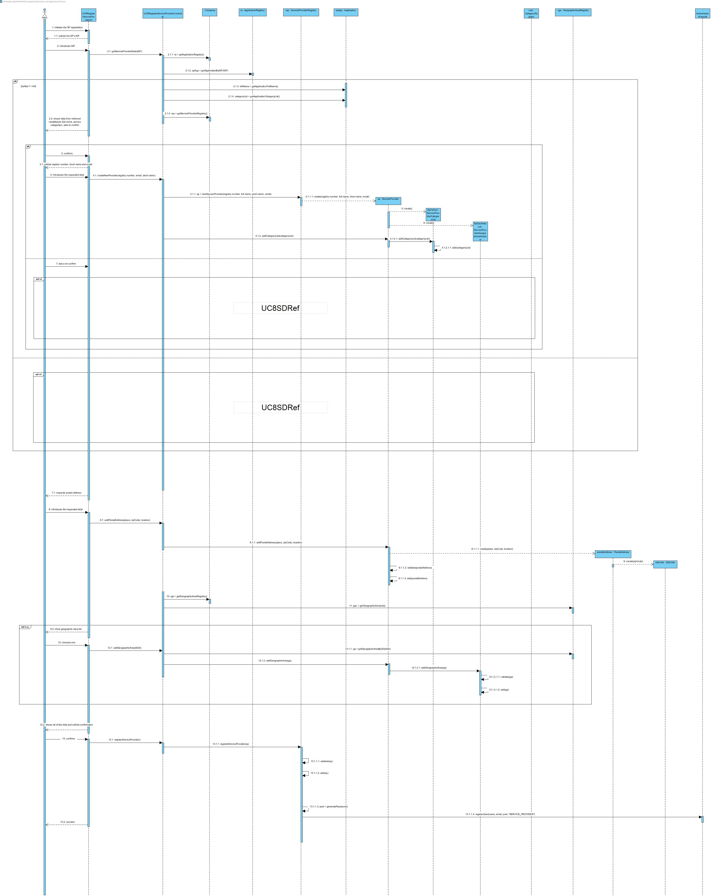
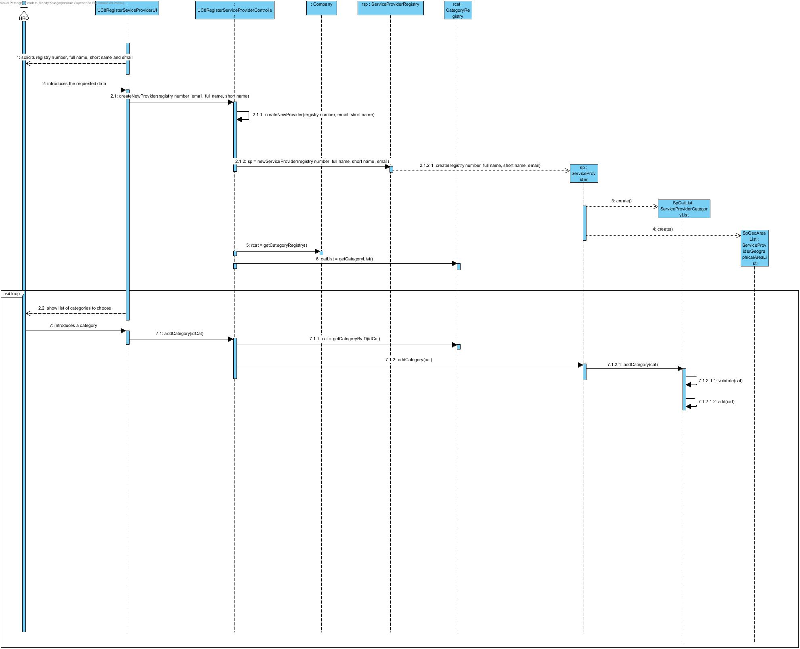
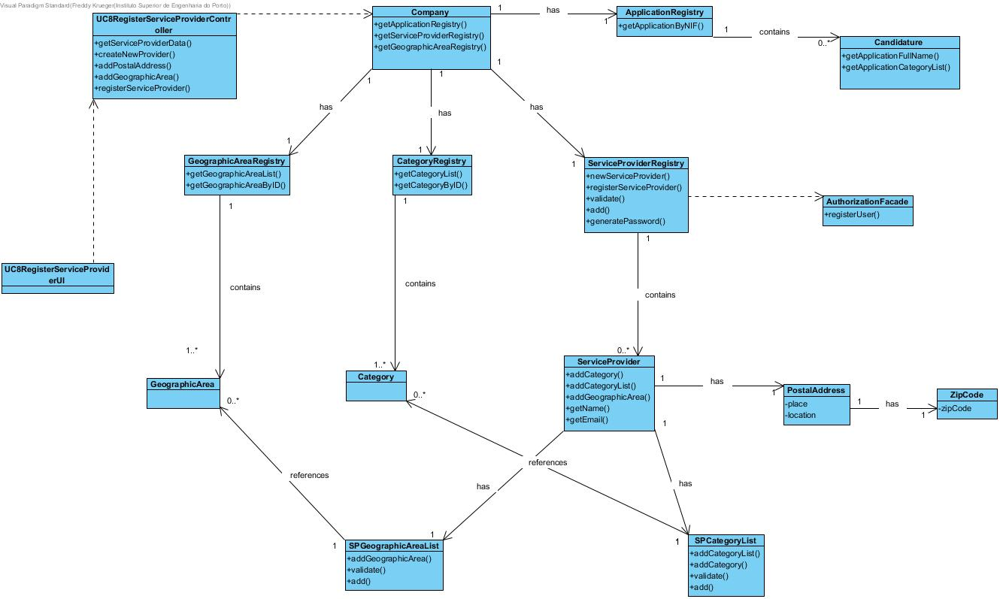

# Exeuction of UC8 Register Service Provider

## Rationale

| Main Flow | Question: Which Class... | Answer | Justification |
|:-------------------------------------------------------------------------------------------------------|:------------------------------------------------------------|:-----------------------------------------------|:---------------------------------------------------------------------------------------------------------------------|
|1. The HRO begins registering the new Service Provider |... interacts with the HRO?| UC8RegisterServiceProviderUI | Pure fabrication from MVC |
||... coordinates the UC? | UC8RegisterServiceProviderController | Pure fabrication from MVC |
|2. The system solicits the SP's NIF ||||
|3. The HRO introduces the NIF | ...returns the service provider Application by it's NIF? | ApplicationRegistry | IE |
||...holds the data? | Application ||
|4. The system retrieves the available information from the Service Provider Candidature (full name and service categories), shows it to the HRO, and asks if he'd like to keep it or insert it anew ||||
|5. The HRO confirms ||||
|6. The system requests the remaining data (short name, registry number and email) ||||
|7. The HRO inserts it | ...creates the Service Provider? | ServiceProviderRegistry | Creator pattern, it has the collection of ServiceProvider |
||... holds the list of categories? | ServiceProviderCategoryList | IE + HC/LC - it's not a system class |
||... will hold the list of geographical areas? | ServiceProviderGeographicalAreaList | IE + HC/LC - it's not a system class |
||... creates the two aforementioned classes | ServiceProvider | Creator |
|8. Alternatively, the HRO rejects it ||||
|9. The system requests some data (full name, short name, registry number and email) ||||
|10. The HRO inserts it | ...creates the Service Provider? | ServiceProviderRegistry | Creator |
||... holds the list of categories? | ServiceProviderCategoryList | HC/LC - it's not a system class |
||... will hold the list of geographical areas? | ServiceProviderGeographicalAreaList | IE + HC/LC - it's not a system class |
||... creates the two aforementioned classes | ServiceProvider | Creator pattern, it has the collection of ServiceProvider |
|11. The system requests a category|...knows the list of categories?| CategoryRegistry | IE |
|12. The HRO inserts at least one | ...validates the inserted category | ServiceProviderCategoryList | IE |
|13. Steps 11 and 12 repeat themselves while the HRO wishes to introduce other categories ||||
|14. The system requests data required for a postal address (place, zip code and location)||||
|15. The HRO inserts the requested data|....creates PostalAddress? | ServiceProvider | Creator pattern, it contains instances of the object as an attribute |
||... creates ZipCode | PostalAddress | Creator pattern |
|16. The system shows a list of existing geographic areas requests a choice of one|...holds the collection of GeographicalArea? | GeographicalAreaRegistry | IE |
|17. The HRO chooses one. | ...creates the GeographicalArea | ServiceProviderGeographicalAreaList | Creator pattern + HC/LC |
|18. Steps 14 and 15 repeat themselves while the HRO wishes to choose other geographic areas||||
|19. The system shows the data and asks for confirmation||||
|20. The HRO confirms ||||
|21. The system wraps up the use case and registers the Service Provider|...registers the ServiceProvider | ServiceProviderRegistry | IE |
||... generates the Password | ServiceProviderRegistry | It holds all of the data required to generate a password, so assigning this to this class keeps data from moving around between classes too much - IE |
||...registers the created ServiceProvider as a user | AuthorizationFacade | PureFabrication |

## Systematization ##

The conceptual classes promoted to software classes in result of the rationale are:

 * Company
 * FRH
 * ServiceProvider
 * Category
 * GeographicalArea
 * PostalAddress
 * ZipCode
 * Application

Outras classes de software (i.e. Pure Fabrication) identificadas:  

 * UC8RegisterServiceProviderUI  
 * UC8RegisterServiceProviderController
 * ServiceProviderRegistry
 * ServiceProviderCategoryList
 * ServiceProviderGeographicalAreaList
 * ApplicationRegistry
 * AuthorizationFacade

##	Sequence Diagrams

Reference diagram:

##	Class Diagram

