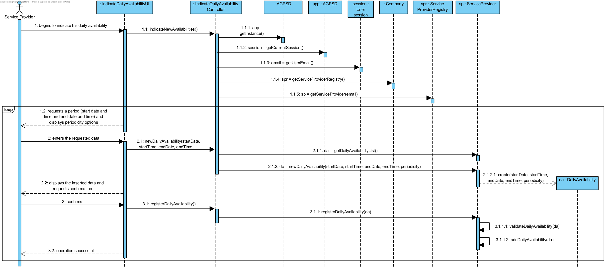
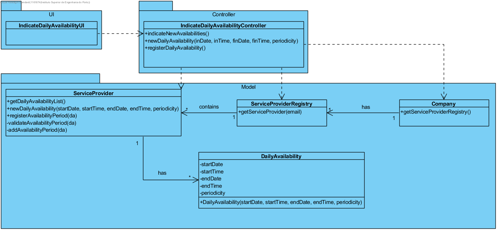

# Execution of UC9 - Indicate Daily Availability

## Rationale

| Main Flow | Question: Which Class... | Answer | Justification |
|:-------------------------------------------------------------------------------------------------------|:------------------------------------------------------------|:-----------------------------------------------|:---------------------------------------------------------------------------------------------------------------------|
|1. The service provider begins to indicate his daily availability.|...interacts with the user?|IndicateDailyAvailabilityUI| Pure Fabrication|
||...coordinates the UC?|IndicateDailyAvailabilityController| Controller|
||...creates/instantiates the DailyAvailability?|ServiceProvider| Creator (Rule 2) -  ServiceProvider indicates several DailyAvailability in the DM.|
||...knows the ServiceProvider class?|ServiceProviderRegistry| HC + LC |
||...knows the ServiceProviderRegistry class?|Company| HC + LC - The Company delegates it's responsibility (earned by applying Creator - Rule 1) to ServiceProviderRegistry by applying HC+LC.|
|2. The system requests a period (start date and time and end date and time) in which the service provider is available to perform services and displays periodicity options.| | | |
|3. The service provider enters the requested data.|...saves the inserted data?|DailyAvailability| Information Expert (IE) - instance created in step 1|
|4. The system validates, displays the inserted data and requests confirmation.|...validates the inserted data (local validation)?|DailyAvailability| IE - DailyAvailability has its own data.|
| |...validates the inserted data (global validation)?|ServiceProvider| IE - ServiceProvider knows all his DailyAvailability.|
|5. The service provider confirms.| | | |
|6. The system register the availability period of the service provider and informs the service provider of the operation success.|...saves DailyAvailability?|ServiceProvider| IE - ServiceProvider knows all his DailyAvailability.|
|7. Steps 2 to 6 are repeated until the service provider has indicated all availability.||||
                                        
## Systematization

The conceptual classes promoted to software classes in result of the rationale are:

 * Company
 * ServiceProvider
 * DailyAvailability

The conceptual classes promoted to software classes in result of the rationale are:  

 * IndicateDailyAvailabilityUI
 * IndicateDailyAvailabilityController
 * ServiceProviderRegistry

##	Sequence Diagram

##	Class Diagram

