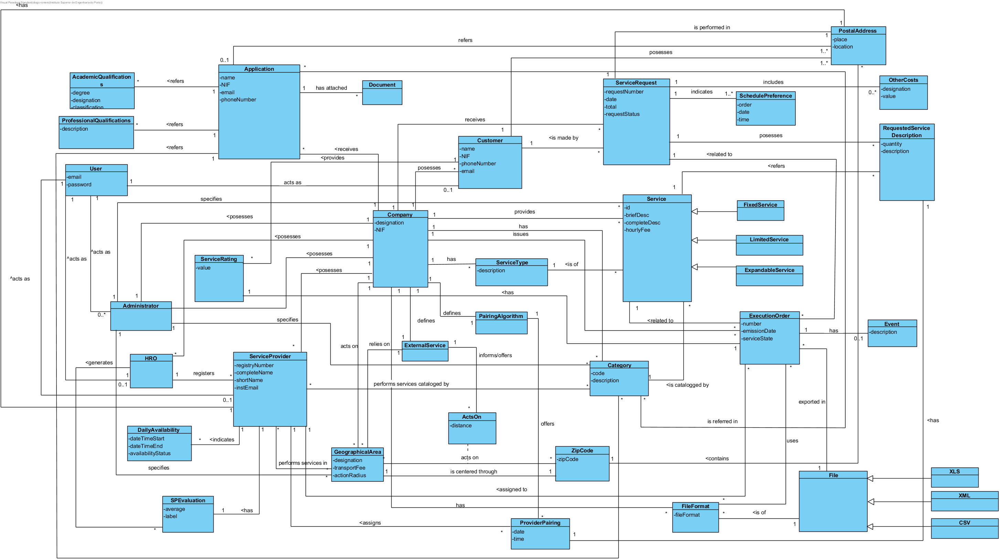

# OO Analysis #
The construction process of the domain model is based on the use cases, especially the nouns used and the assignment's details.

## Rationale to identification of domain model's classes ##
The following categories list is based on the material from ESOFT classes and is used as a way to identify the domain model's classes.

### _Categories List_ ###

**Transactions (of the business)**

* Application
* Service Request
* Execution Order

---

**Transaction lines**

* Schedule Preference
* Requested Service Description
* Other Costs
* Provider Pairing

---

**Products or services related to transactions**

*  Service
*  Expandable Service
*  Fixed Service
*  Limited Service

---

**Records (of transactions)**

* Service Rating
* Service Provider Evaluation 

---

**People's roles**

* Administrator
* Human Resources Officer (HRO)
* Customer
* Service Provider
* Registered User
* Unregistered User

---

**Places**

* Geographical Area
* Postal Address
* Zip Code

---

**Events**

* 

---

**Physical objects**

* 

---

**Specifications and descriptions**

* (Specify) Category (of Service)
* (Specify) Service
* Academic Qualification
* Professional Qualification
* Daily Availability
* Service Type
* File
* File Format

---

**Catalogues**

*  

---

**Sets**

*

---

**Elements Sets**

*  

---

**Organization**

* Company

---

**Other systems (external)**

*  External Service
*  Pairing Algorithm

---

**Records (financial), of labour, contracts, legal documents**

* 

---

**Financial instruments**

*  

---

**Referred documents/to perform the tasks/**

* Document (of Service Provider Application)

---

###**Rationale on identification of associations between classes**###

An association is a relationship betwween instances of objects that indicates a relevant connection that is worth mentioning or is a derivative of the list of common associations.

+ A is physically or logically  a part of B.
+ A is physically or logically contained in B.
+ A is a description of B.
+ A is known/captured/processed by B.
+ A uses or generates B.
+ A is related to a transaction of B + etc.

| Concept (A) 		                |  Association   		            |  Concept (B) |
|----------	   		                |:-------------:		            |------:       |
| Administrator 	                | works for     	                | Company |
|   				                | specifies         	            | Service  |
|   				                | specifies     	                | Category  |
|   				                | specifies                         | Geographical Area|
| Category		                    | catalogs    		                | Service  |
|					                | referred in           	        | Service Provider  |
|				    	            | referred in    	                | Application  |
| Company		    	            | posesses                          | Customer  |
|				                	| posesses      	                | Administrator |
|				    	            | posesses		                    | Human Resourses Officer (HRO)|
|				                	| posesses	                        | Service Provider |
|				    	            | receives	                        | Application |
|				    	            | receives		                    | Service Request |
|				    	            | provides		                    | Service |
|				    	            | has		                        | Category  |
|				    	            | has		                        | File Format |
|				    	            | has		                        | Service Type  |
|				    	            | issues        	                | Execution Order |
|				    	            | defines       	                | Pairing Algorithm  |
|				                	| defines   	    	            | External Service |
|				                	| acts on     		                | Geographical Area |
| Customer          	            | posesses                          | Postal Address  |
|				    	            | performs      	                | Service Request |
|				    	            | provides  		                | Service Rating |
| Execution Order                   | related to                        | Service Request  |
|					                | related to        	            | Service |
|				    	            | assigned to  	    	            | Service Provider |
|					                | has  		                        | Service Rating |
|				    	            | exported in  	                    | File |
|                                   | uses                              | File Format |
| External Service  	            | offers/informs                    | Acts On |
| Geographical Area 	            | relies on                         | Extrernal Service  |
|					                | acts on         	                | Zip Code |
|					                | is centered through 	            | Zip Code |
| Human Resources Officer (HRO)	    | generates   			            | Service Provider Evaluation  |
|									| registers							| Service Provider  |
| Pairing Algorithm         		| offers        		            | Provider Pairing  |
| Postal Address            		| contains       		            | Zip Code  |
| Provider Pairing          		| assigns       		            | Service Provider  |
| Service                      		| is referred in       	            | Requested Service Description |
|					                | is of         	                | Service Type |
| Fixed Service                     | is a specification of             | Service  |
| Limited Service                   | is a specification of             | Service  |
| Expandable Service                | is a specification of             | Service  |
| Service Provider                  | performs services catalogged in   | Category |
|					                | refers        	                | Category |
|					                | is assigned to     	            | Execution Order |
|					                | is assigned by        	        | Provider Pairing |
|					                | performs services in        	    | Geographical Area |
|					                | has              	                | Service Provider Evaluation |
|					                | has       	                    | Postal Address|
|					                | indicates       	                | Daily Availability |
|					                | is registered by       	        | Human Resources Officer (HRO) |
| Application				        | refers                            | Postal Address |
|					                | refers        	                | Category |
|					                | refers             	            | Academic Qualifications |
|					                | refers                	        | Professional Qualifications|
|					                | has attached              	    | Document |
| Service Request                   | includes                          | Other Costs |
|					                | indicates       	                | Schedule Preference |
|					                | posesses             	            | Requested Service Description |
| Requested Service Description     | refers                            | Service |
|					                | has              	                | Provider Pairing |
| User                              | acts as                           | Administrator |
|                                   | acts as                           | Customer |
|                                   | acts as                           | Human Resources Officer (HRO)|
|                                   | acts as                           | Service Provider |

**Note:** The external service provides the distance for zip codes. Each pair of information Distance + Zip Code is used to establish the association "acts on" between GeographicalArea and ZipCode.

## Domain Model

