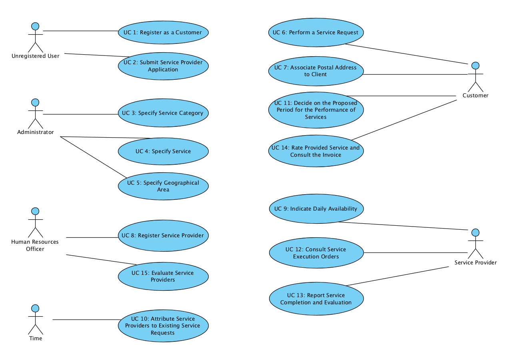

# Use Cases Diagram

# Use Cases
| UC  | Description                                                             |                   
|:----|:------------------------------------------------------------------------|
| UC1 | [Customer Registration](UseCases/UC1_PerformCustomerRegistry.md) |
| UC2 | [Submit Service Provider Application](UseCases/UC2_SubmitServiceProviderApplication.md) |
| UC3 | [Specify Service Category](UseCases/UC3_SpecifyServiceCategory.md) |
| UC4 | [Specify Service](UseCases/UC4_SpecifyService.md) |
| UC5 | [Specify Geographical Area](UseCases/UC5_SpecifyGeographicalArea.md) |
| UC6 | [Perform a Service Request](UseCases/UC6_PerformServiceRequest.md) |
| UC7 | [Associate Postal Address to Customer](UseCases/UC7_AssociatePostalAddress.md) |
| UC8 | [Register Service Provider](UseCases/UC8_RegisterServiceProvider.md)|
| UC9 | [Indicate Daily Availability](UseCases/UC9_IndicateDailyAvailability.md) |
| UC10 | [Attribute Service Providers to Existing Service Requests](UseCases/UC10_AttributeServiceProvidersToServiceRequests.md) |
| UC11 | [Decide on the Suggested Period for the Service Execution](UseCases/UC11_DecideOnPeriodForServiceExecution.md) |
| UC12 | [Consult Service Execution Orders](UseCases/UC12_ConsultServiceExecutionOrders.md) |
| UC13 | [Report Service Completion and Evaluation](UseCases/UC13_ReportServiceCompletion.md) |
| UC14 | [Rate Provided Service and Consult the Invoice](UseCases/UC14_RateProvidedService.md) |
| UC15 | [Evaluate Service Providers](UseCases/UC15_EvaluateServiceProviders.md) |