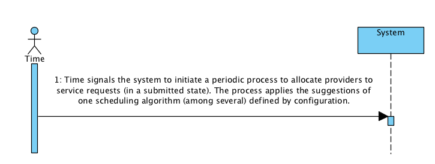

# UC10 - Attribute Service Providers to Existing Service Requests

## Short Format

Time signals the system to initiate a periodic process to allocate providers to service requests (in a submitted state). The process applies the suggestions of one scheduling algorithm (among several) defined by configuration.

## SSD

## Complete Format

### Primary actor
Time

### Stakeholders and their interests
* **Company:** wants its customers to be able to have service providers assigned to their service requests.
* **Customer:** wants to have service providers assigned to each of his/her requests.
* **Service Provider:** wants to be assigned to service requests.

### Preconditions
Having Service Providers and Service Requests in the system.

### Post-conditions
The pairing information is saved in the system. When all the services in a service request have a provider assigned, the pairing information should be available to the client.

## Main success scenario (or basic flow)
1. Time signals the system to initiate a periodic process to allocate providers to service requests (in a submitted state). The process applies the suggestions of one scheduling algorithm (among several) defined by configuration.

### Extensions (or alternative flow)
*a. The system fails and the process is interrupted.*
	> 1. The system reconstructs the previous state.
	> 2. The system reboots the process (step 1).

### Special requirements
Scheduling algorithm and interval period between executions are defined by configuration.

### Technology and data variations list
\-

### Frequency of occurrence
Regular (depends on the decided interval period)

### Open issues
\-