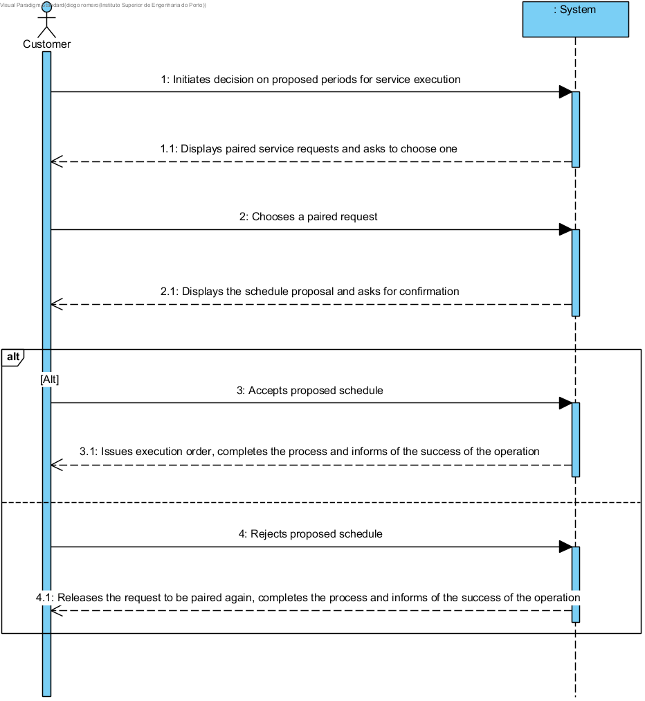

UC11 - Decide on the Proposed Schedules for the Service Execution
==============================

Brief Format
-------------

After the pairing of a Costumer's Service request,the system notifies previously the Customer by email. The Customer afterwards accesses the system in order to take decision on the proposed schedules for the execution of the requested tasks, and after each schedule confirmed, the system notifies of the success of the operation.

SSD
---

Complete Format
----------------

### Main Actor

Customer

### Intereseted parties and their interests

-   **Customer:** wishes to decide on the proposed paired schedules.

-   **Company:** wishes the Customer to be able to decide on the most convenient schedule for him.

### Pre-Conditions

The Service Requests need to be previously paired in order for the Customer to take a decision.

### Post-Conditions

The requests were the paired schedules are confirmed have issued an execution order confirming the request is active.

Main Scenario of Success(or basic flow)
----------------------------------------------

1.  The Customer initiates the decision on proposed periods for service execution.
2.  The system displays the paired service requests and asks the Customer to choose one.
3.  The Customer chooses the paired request.
4.  The system presents the schedule proposal for the paired request and asks for confirmation.
5.  The Customer accepts the proposed schedule.
6.  The system issues an execution order and informs of the success of the operation. 

    

### Extensions (or alternate flows)

\*a. The Customer cancels the decision on the proposed schedules.

>   The user case ends.

5a. The Customer rejects the proposed schedule.
>   1. The system releases the request to be paired again and informs of the success of the operation.
>
	>	The user case ends

### Special Requirements

\-

### List of Technology and/or Data variations

\-

### Frequency of occurrence

\-

### Open questions

-  
