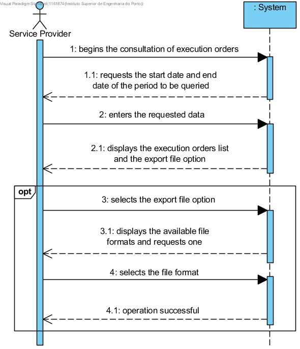

# UC12 - Consult Service Execution Orders

## Short Format

The service provider begins the consultation of service execution orders. The system requests the start date and end date of the period to be queried. The service provider enters the requested dates. The system displays the execution orders list and the option to export the list to a file.
Optionally, the service provider selects the option to export to a file. The system requests the file format. The service provider selects the file format. The system informs the service provider of the operation success.

## SSD

## Complete Format

### Primary actor
Service Provider

### Stakeholders and their interests
* **Service Provider:** wants to consult the service execution orders that have been assigned to him for a given period.
* **Company:** allow the service provider to consult service execution orders.

### Preconditions
Authentication as a Service Provider.

### Post-conditions
The system shows a list with the execution orders and optionally exports a file, with the list, in a format selected by the service provider.

## Main success scenario (or basic flow)

1. The service provider begins the consultation of execution orders.
2. The system requests the start date and end date of the period to be queried.
3. The service provider enters the requested data.
4. The system displays the execution orders list and the export file option.
5. The service provider selects the export file option.
6. The system displays the available file formats and requests one.
7. The service provider selects the file format.
8. The system informs the service provider of the operation success.

### Extensions (or alternative flow)

*a. The service provider requests the cancellation of the application.
>	The use case is over.

3a. Data from the queried period is incomplete.
>   1. The system displays which data is missing.
>	2. The system allows the missing data to be entered (step 3).
>
	>	2a. The service provider doesn't change the data. The use case ends.

3b. The system detects there's data (or some subset of data) entered that's invalid.
>   1. The system alerts the service provider.
>	2. The system allows to change the data (step 3).
>
	>	2a. The service provider doesn't change the data. The use case ends.

4a. The user doesn't select the export file option.
>   1. The system alerts the service provider.
>	2. The system allows to select the option (step 4).
>
	>	2a. The service provider doesn't select the option. The use case ends.

### Special requirements
\-

### Technology and data variations list
\-

### Frequency of occurrence
\-

### Open issues
\-
