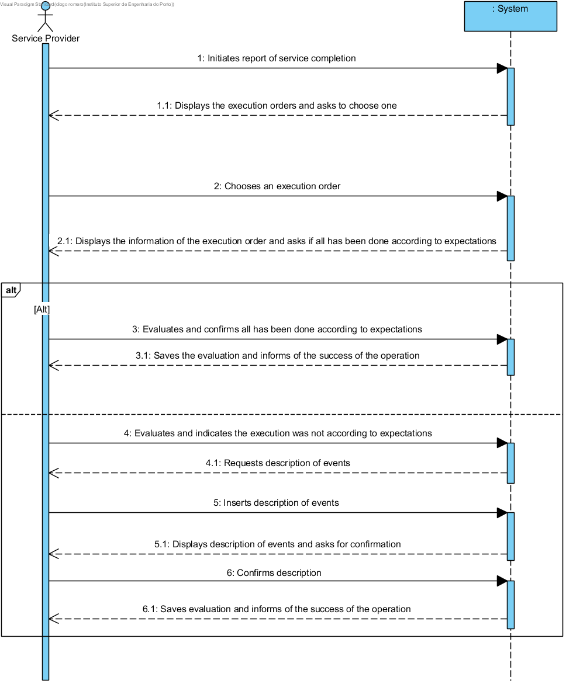

# UC13 - Report Service Completion 

## Brief Format

The service provider initiates the report of service completion. The system displays all of the Service Provider's Execution Orders and asks him to choose one. The Service Provider chooses a certain execution order. Afterwards the system asks the user if the task had been performed according to expectations or if there are events to be reported. The Service Provider can 

## SSD

## Complete Format

### Primary actor
Service Provider

### Stakeholders and their interests
* Service Provider: wants to report the conclusion of a certain task and report any unexpected events
* Company: allow the service provider to report the conclusion of the tasks and gather information on unexpected events.
* HRO : wishes to analyse the evaluations and reports of unexpected events

### Preconditions
Authentication as a Service Provider.

### Post-conditions
The system saves the evaluation and considers the service concluded.

## Main success scenario (or basic flow)

1. The service provider initiates the report of serice completion.
2. The system displays the current Execution Orders and asks to choose one.
3. The service provider chooses an execution order.
4. The system displays the information of the concerned execution order and asks for the evaluation and  if all had been done according to expectations.
5. The service provider inserts the evaluation and confirms.
6. The system informs the service provider of the operation success.

### Extensions (or alternative flow)

*a. The service provider requests the cancellation of the report of conclusion.
>	The use case is over.

4a. Data from the execution order is incorrect.
>   1. The system displays which data is incorrect.
>	2. The system allows the wrong data to be corrected (step 3).
>
	>	2a. The service provider doesn't change the data. The use case ends.

	
6c. The Service Provider wishes to report an unexpected event
>   1. The system asks for a description of the occurrency.
>	2. The Service Provider inserts the description of the occurency.
>
	>	2a. The service provider doesn't change the data. The use case ends.

### Special requirements
\-

### Technology and data variations list
\-

### Frequency of occurrence
\-

### Open issues
\-
