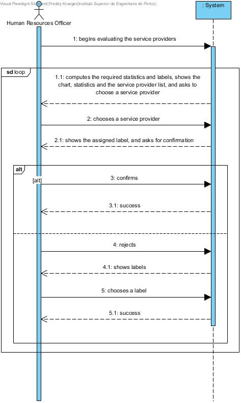

# UC15 - Evaluate Service Providers

## Short format 

The Human Resources Officer (HRO) begins evaluating the Service Provider. The system computes all of the required statistics for the ratings such as: mean (for the population), standard deviation (for the population), the absolute differences between the average ratings of each service provider and the mean rating of all service providers. Then the system shows the HRO a chart with the histogram showing SP rating distribution, the statistics and shows the service provider list and asks for one. The HRO chooses one. The system computes and provides the computed label and asks to confirm it. The HRO confirms, and the system confirms the success. Alternatively, the HRO rejects the label, the system shows the HRO a list of the possible labels, the HRO chooses one, and the system confirms the success.

**Note:** while the use case originally specified the computation of the individuals statistics in this case, it was decided that said computation would be done automatically and immediately after the Customer finished rating the Service Provider

## SSD

## Complete format

### Main actor

HRO (Human Resources)

### Interested parties and their motivations

* **HRO** intends to evaluate service providers
* **Company** wishes to have it's Service Providers rated according to their performance
* **Service Provider** intends to have a rating so customers have a reference for him
* **Customer*** intends to know the rating of the Service Provider

### Initial restrictions 
* Up-to-date statistics on Service Providers *
The system should have at least one rated Service Provider

### Final restrictions 
n/a

## Main success scenario (principal flow)

1. The Human Resources Officer (HRO) begins evaluating the Service Provider
2. The system computes all of the required statistics for the ratings such as: mean (for the population), standard deviation (for the population), the absolute differences between the average ratings of each service provider and the mean rating of all service providers. Then the system shows the HRO a chart with the histogram showing SP rating distribution, the statistics and shows the service provider list and asks for one
3. The HRO chooses one
4. The system computes and provides the computed label and asks to confirm it
5. The HRO confirms
6. The system confirms the success
7. Alternatively, the HRO rejects the label
8. The system shows the HRO a list of the possible labels
9. The HRO chooses one
10. The system confirms the success
11. Steps 2 through 10 repeat themselves while the HRO wishes to label Service Providers

### Extensions (or alternative flows)

*a. The HRO cancels the registration 

> The use case ends 

2a. There are no Service Providers to rate
>	1. The system informs the HRO.
>	2. The use case ends

4a. Incomplete data/no Service Providers introduced 
>	1. The system informs the HRO.
>	2. The system permits the introduction of new data
>
	>	2a. The HRO does not change the data, the use case ends
	
10a. Incomplete data/no Labels introduced 
>	1. The system informs the HRO.
>	2. The system permits the introduction of new data
>
	>	2a. The HRO does not change the data, the use case ends

### Special requirements 
\-

### List of variations in technology and data
\-

### Frequency of occurrence
\-

### Unanswered questions

* How often does this use case occur?
* What type of charts should be shown?
* Should the HRO have the option to see different types of charts?