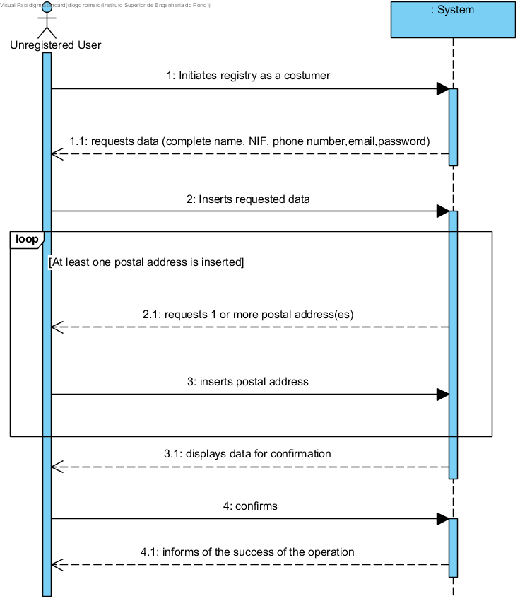

# UC1 - Perform Costumer Registry

## Brief Format

The unregistered user initiates his registration as a costumer. The system requests the necessary data (complete name, phone number, email, password and at least one postal address). The unregistered user introduces the solicited data. The system validates and presents the data asking the unregistered user to confirm them. The unregistered user confirms them and the system notifies of the success of the operation.

## SSD

## Complete Format

### Main Actor

Unregistered User

### Interested parties and their interests
* **Unregistered user:** pretende registar-se para que possa usufruir dos serviços prestados pela empresa.wishes to register in the system in order to profit from the services provided by the company
* **Company:** wishes for the person to register themselves as a costumer in order to perform service requests

### Pre-conditions
n/a

### Post Conditions
The user data is registered in the system.

## Main Scenario of Success (or basic flow)

1. The unregistered user initiates the registry as a costumer
2. The system requests the necessary data ( i.e the person’s complete name, NIF, phone number, e-mail and password)
3. The unregistered user inserts the requested data.
4. The system requests a postal address.
5. The unregistered user inserts the postal address.
6. The system validates and saves the introduced address.
7. The steps 4 to 6 repeat themselves as until all the postal addresses have been inserted (minimum one).
8. The system validates and presents the data asking for confirmation.
9. The unregistered user confirms.
10. The system saves the costumer’s data and informs the user of the success of the operation.

### Extensions (or alternative flows)

*a. The unregistered user requests the cancellation of the registry.

> The user case ends.

4a. The NIF and/or postal address is/are duplicates.
>	1. The system informs the user about the duplicate information.
>	2. The system allows the insertion of new data (step 3)
>
	>	2a.The unregistered user does not change the data. The user case ends.

6b. Incomplete postal address data.
>	1. The system informs of the missing data.
>	2. The system allows for insertion of missing data (step 5).
>
	>	2a. The unregistered user does not insert new data. The user case ends.
	
8a. Mandatory data missing.
>	1. The system informs of the missing data.
>	2. The system allows for insertion of missing data (step 3).
>
	>	2a. The unregistered user does not insert new data. The user case ends.

8b. The system detects that some inserted data (or a subset of data) must be unique and that they already exist in the system.  
>	1. The system warns the unregistered user of the fact.
>	2. The system allows its modification (step 3).
>
	>	2a. O utilizador não registado não altera os dados. O caso de uso termina.

8c. O sistema detecta que os dados introduzidos (ou algum subconjunto dos dados) são inválidos.
> 1. O sistema alerta o utilizador não registado para o facto. 
> 2. O sistema permite a sua alteração (passo 3).
> 
	> 2a. The unregistered user does not insert new data. The user case ends.

### Special Requirements
\-

### List of Data and/or Technology variations
\-

### Ocurrance frequency
\-

### Open Questions
*