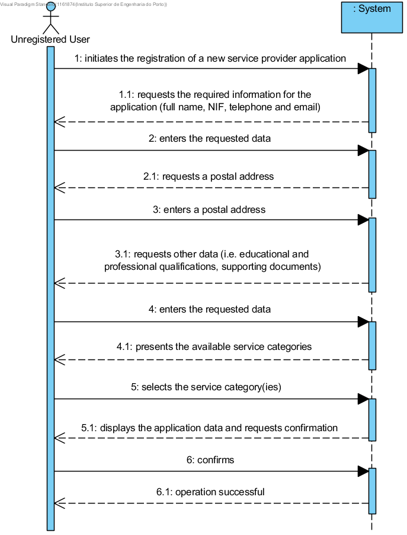

# UC2 - Submit Service Provider Application

## Short Format

The unregistered user initiates the registration of a new service provider application. 
The system requests the required information for the application (full name, NIF, 
telephone, email, postal address), educational and professional qualifications, 
supporting documents). The unregistered user enters the requested data. The system presents 
the service categories and asks for a selection of those he wants to carry out. 
The unregistered user selects the desired categories. The system validates, displays 
the information and requests confirmation. The unregistered user confirms the information 
of the application. The system registers the new application and informs the user of the operation success.

### SSD

## Complete Format

### Primary actor
Unregistered user

### Stakeholders and their interests
**Unregistered user:** wants to present an application to become a company's service provider.

**Company:** intends that any person who wishes to collaborate with the company submits an 
application for service provider.

### Preconditions
n/a

### Post-conditions
The service provider application is registered in the system.

## Main success scenario (or basic flow)

1. The unregistered user initiates the registration of a new service provider application.
2. The system requests the required information for the application (full name, NIF, telephone and email).
3. The unregistered user enters the requested data.
4. The system requests a postal address.
5. The unregistered user enters a postal address.
6. The system validates and saves the entered postal address.
7. The system requests an academic qualification.
8. The unregistered user enters the academic qualification.
9. The system validates and saves the academic qualification.
10. Steps 8 to 10 are repeated until all academic qualifications have been entered.
11. The system requests a professional qualification.
12. The unregistered user enters the professional qualification.
13. The system validates and saves the professional qualification.
14. Steps 12 to 14 are repeated until all the professional qualifications have been entered.
15. The system requests a supporting document.
16. The unregistered user uploads a supporting document.
17. The system validates and saves the supporting document.
18. Steps 16 to 18 are repeated until all supporting documents have been uploaded.
19. The system presents the service categories available in the system.
20. The unregistered user selects the service category(ies) of the service(s) that he proposes to perform.
21. The system validates and saves the selected category.
22. Steps 20 to 22 are repeated until all the categories have been entered.
23. The system validates, displays the application data to the unregistered user and requests his confirmation.
24. The unregistered user confirms the application data.
25. The system registers the new application and informs the unregistered user of the operation success.

### Extensions (or alternative flow)

*a. The unregistered user requests the cancellation of the application.
>	The use case is over.

6a. Incomplete postal address data.
>   1.  The system displays which data is missing.
>	2.  The system allows the missing data to be entered (step 5).
>
    >   2a. The unregistered user doesn't change the data. The use case ends.

10a. Incomplete academic qualification data.
>   1.  The system displays which data is missing.
>   2.  The system allows the missing data to be entered (step 9).
>
    >   2a. The unregistered user doesn't change the data. The use case ends.

14a. Incomplete professional qualification data.
>   1.  The system displays which data is missing.
>	2.  The system allows the missing data to be entered (step 13).
>
    >   2a. The unregistered user doesn't change the data. The use case ends.

14a. Document format is not supported.
>   1.  The system displays this information.
>	2.  The system allows the upload of another document (step 13).
>
    >   2a. The unregistered user doesn't change the data. The use case ends.

20a. The system doesn't have any service categories to display.
>   1.  The system informs that there are no service categories.
>
    >   The use case proceeds to step 24.

24a. Required data missing.
>   1.  The system displays which data is missing.
>	2.  The system allows the missing data to be entered (step 3).
>
    >   2a. The unregistered user doesn't change the data. The use case ends.

24b. The system detects there's data (or some subset of data) entered that's 
not unique and already exists in the system.
>   1.  The system alerts the unregistered user.
>	2.  The system allows to change the data (step 3).
>
    >   2a. The unregistered user doesn't change the data. The use case ends.

24c. The system detects there's data (or some subset of data) entered 
that's invalid.
>   1.  The system alerts the unregistered user.
>	2.  The system allows the invalid data to be entered (step 3).
>
    >   2a. The unregistered user doesn't change the data. The use case ends.

### Special requirements
/-

### Technology and data variations list
/-

### Frequency of occurrence
/-

### Open issues
/-
