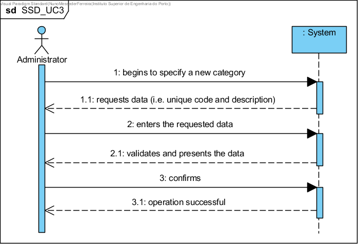

# UC3 - Specify Category (of Service)

**(Hasn't been modified in this iteration)**

## Brief Format

The administrator begins to specify a new category. The system requests the necessary data (i.e. unique code and description). The administrator person enters the requested data. The system validates and presents the data to the administration, asking them to confirm it. The administrator confirms. The system records the data and informs the administration of the success of the operation.

## SSD

## Full Format

### Lead actor

Administrator

### Stakeholders and their interests
* **Administrator:** intends to specify the categories of services so that it can later catalog the various services rendered.
* **Client:** the cataloguing of the services in categories facilitates the realization of their actions.
* **Company:** intends that it is possible to catalogue its services.

### Preconditions
n/a

### Post-conditions
The category information is recorded in the system.

## Main success scenario (or basic flow)

1. The administrator department begins to specify a new category. 
2. The system requests the necessary data (i.e. unique code and description). 
3. The administrator authority shall enter the requested data. 
4. The system validates and presents the data to the administrator authority, asking it to confirm them. 
5. The administrator officer shall confirm. 
6. The system records the data and informs the administration of the success of the operation.

### Extensions (or alternative flows)

*a. The administrator requests the cancellation of the category specification.

> The case of use ends.

4a. Minimum mandatory data missing.
> 1. The system informs which data is missing.
> 2. the system allows the entry of missing data (step 3)
>
	> 2a. The administrator does not change the data. The use case ends.

4b. The system detects that the data (or a subset of the data) entered must be unique and that it already exists in the system.
> 1. The system alerts the administrator department to this fact.
> 2. the system allows its modification (step 3)
>
	> 2a. The administrator does not change the data. The use case ends.

4c. The system detects that the data entered (or a subset of the data) is invalid.
> 1. The system alerts the administrator department to this fact. 
> 2. The system allows you to change it (step 3).
> 
	> 2a. The administrator does not change the data. The use case ends. 

### Special requirements
\-

### List of Technology and Data Variations
\-

### Frequency of Occurrence
\-

### Open questions

* Is there any other data that is required?
* What is the mandatory data for the specification of a category?
* What data together can detect duplication of categories?
* Is the unique code always entered by the administrator or should the system generate it automatically?
* How often is this use case occurring?
