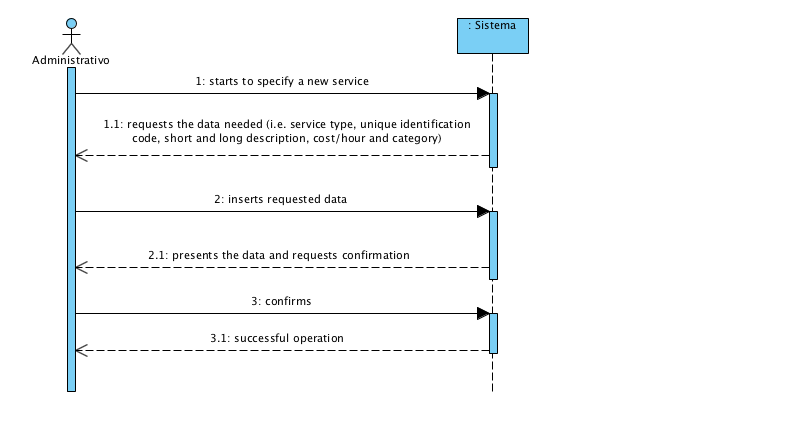

# UC4 - Specify Service

## Short Format

The administrator starts to specify a new service. The system requests the data needed (i.e. service type, unique identification code, short and long description, category of service and cost/hour). The administrator inserts the required data. The system validates and presents the data to the administrator, requesting confirmation. The administrator confirms. The systems registers the data and informs the administrator about the success of the operation.

## SSD

## Complete Format

### Primary actor

Administrator

### Stakeholders and their interests
* **Administrator:** wants to specify the services so costumers can request them.
* **Costumer:** wants to know the services available for request.
* **Company:** wants the services to be accurately described, detailed and properly cataloged.

### Preconditions
n/a

### Post-conditions
Service information is saved in the system.

## Main success scenario (or basic flow)

1. The administrator starts to specify a new service.
2. The system shows the service types supported and requests the choice of one.
3. The administrator chooses the service type wanted.
4. The system requests the data needed (i.e. unique identification code, short and long description and cost/hour).
5. The administrator inserts the required data.
6. The system shows the list of existing categories and requests the choice of one.
7. The administrator chooses the category in which the service will be cataloged.
8. The system requests additional data if the service type requires it.
9. The administrator inserts the requested data.
10. The system validates and presents the data to the administrator, requesting confirmation.
11. The administrator confirms.
12. The systems registers the data and informs the administrator about the success of the operation.

### Extensions (or alternative flow)

*a. The administrator requests the cancellation of the service specification.

> The use case ends.

2a. There aren't any service types defined in the system.
> 1. The system informs the administrator about it. The use case ends.

6a. There aren't any service categories defined in the system.
>   1. The system informs the administrator about it.
>   2. The system allows for the creation of a new category (UC 3).
>
	> 2a. The administrator doesn't create a new category. The use case ends.

8a. It isn't necessary to request any additional data.
> 1. The system jumps immediately to step 10.

10a. Mandatory data is missing.
>	1. The system informs which data is missing.
>	2. The system allows for the introduction of the missing data (step 3).
>
	>	2a. The administrator doesn't change the data. The use case ends.

10b. The system detects that introduced data (or a subset of it) should be unique and that these already exist in the system.
>	1. The system informs the administrator about it.
>	2. The system allows the change of the data (step 3).
>
	>	2a. The administrator doesn't change the data. The use case ends.

10c. The system detects that introduced data (or a subset of it) are invalid.
> 1. The system informs the administrator about it. 
> 2. The system allows to change the data (step 3).
> 
	> 2a. The administrator doesn't change the data. The use case ends. 

### Special requirements
\-

### Technology and data variations list
\-

### Frequency of occurrence
\-

### Open issues
\-