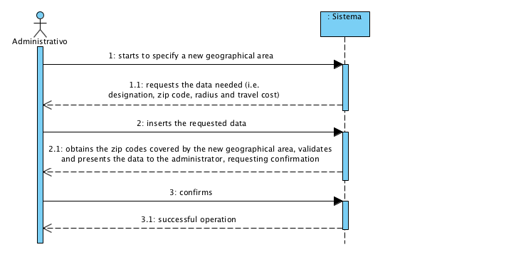

# UC5 - Specify Geographical Area

## Short Format

The administrator starts to specify a new geographical area. The system requests the data needed (i.e. designation, zip code, radius and travel cost). The administrator inserts the requested data. The system obtains the zip codes covered by the new geographical area, validates and presents the data to the administrator, requesting confirmation. The administrator confirms. The system registers the new geographical area and informs the administrator about the success of the procedure.

## SSD

## Complete Format

### Primary actor

Administrator

### Stakeholders and their interests
* **Administrator:** intends to specify the geographical areas and the travel costs associated.
* **Costumer:** intends to know in which geographical areas the company provides services and know also the travel costs associated.
* **Company:** intends for the geographical areas to be described accurately and with detail.

### Preconditions
n/a

### Post-conditions
The information of the geographical area is registered in the system.

## Main success scenario (or basic flow)

1. The administrator starts to specify a new geographical area.
2. The system requests the data needed (i.e. designation, zip code, radius and travel cost).
3. The administrator inserts the requested data.
4. The system obtains the zip codes covered by the new geographical area, validates and presents the data to the administrator, requesting confirmation.
5. The administrator confirms.
6. The system registers the new geographical area and informs the administrator about the success of the procedure.

### Extensions (or alternative flow)

*a. The administrator requests the cancellation of the geographical area specification.

> The use case ends.
	
4a. Mandatory data is missing.
> 1. The system informs which data is missing.
> 2. The system allows for the introduction of the missing data (step 3).
>
	> 2a. The administrator doesn't change the data. The use case ends.

4b. The system detects that introduced data (or a subset of it) should be unique and that these already exist in the system.
>	1. The system alerts the administrator.
>	2. The system allows the change of the data (step 3).
>
	>	2a. The administrator doesn't change the data. The use case ends.

4c. The system detects that introduced data (or a subset of it) are invalid.
> 1. The system alerts the administrator.
> 2. The system allows the change of the data (step 3).
> 
	> 2a. The administrator doesn't change the data. The use case ends. 

4d. The system can't determin the zip codes covered by the geographical area.
> 1. The system alerts the administrator.
>  The use case ends. 

### Special requirements
\-

### Technology and data variations list
The system must use an external service defined by configuration in order to obtain the zip codes covered by the geographical area. 

### Frequency of occurrence
\-

### Open issues
\-
