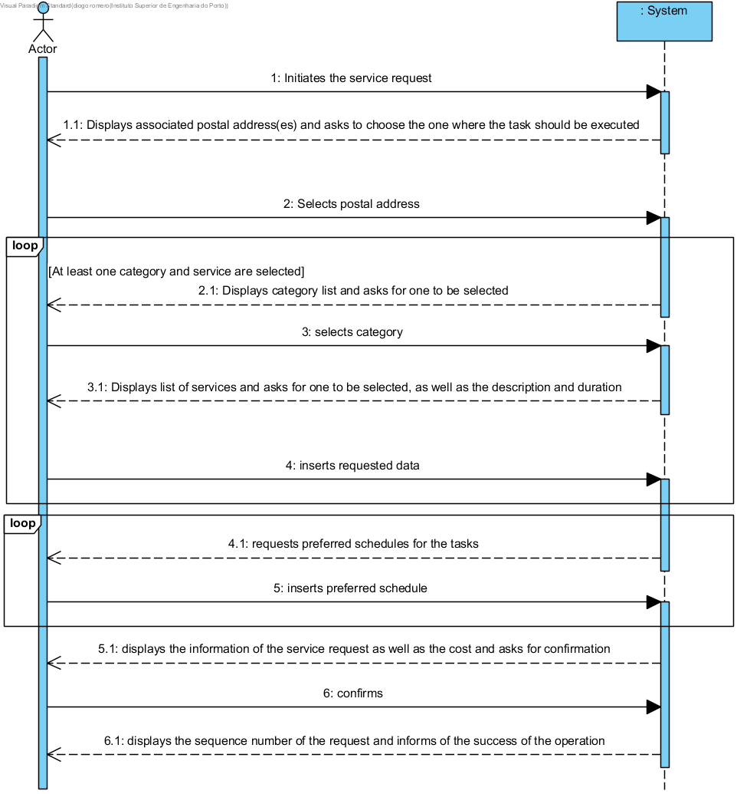

# UC6 - Perform Service Request

## Brief Format

The costumer initiates the service request. The system displays the associated postal addresses and requests the costumer to choose the address where he wishes for the services to be made. The costumer chooses the concerned address. The system displays the categories of the services and requests the costumer to choose one. The costumer selects the category and the system presents the services for that category, asking the costumer to select one of them. The costumer selects the service and adds a description to the service request that represents the task that the costumer wishes to be executed, and in case of the services that allow the specification of the duration, the costumer also informs of the duration of the desired task. The category and service selections above mentioned repeat themselves until all the desired services are all specified. Afterwards the system requests the insertion of one or more preferred schedules (date and beginning time) for the execution of the task. The costumer inserts these schedules. The system validates the request, calculating its estimated cost and displays the result to the costumer, asking for a confirmation. The costumer confirms the request. The system saves it, assigns it with a sequence number, and presents it to the costumer as well as message confirming the success of the operation.

## SSD

## Complete Format

### Main Actor

Costumer

### Interested Parties and their interests
* **Costumer:** wishes to register his request in order to profit from the services provided by the company.
* **Company:** wishes for their costumers to request for services.

### Pre-conditions
- There must be at least one service saved in the system.

### Post-Conditions
- The service request information is saved in the system

## Main scenario of success (or basic flow)

1. The costumer initiates the service request.
2. The system displays the postal addresses associated to the costumer and asks him to choose the one where he wishes to have the executed task.
3. The costumer selects the desired postal address.
4. The system presents the categories of services and asks the costumer to select one.
5. The costumer selects the desired category.
6. The system presents the services of that category, asking the costumer to select one of them and to complement with a representative description of the task to be executed, and in case of the services which allow the specification of the duration, to also specify the duration of the desired task.
7. The costumer selects the desired service and inserts the the description and estimated duration.
8. The system validates and saves the introduced data.
9. The steps 4 to 8 repeat themselves until all of the services desired by costumer are specified.
10. The system requests the insertion of a preferred schedule (date and beginning time) for the execution of the task.
11. The costumer inserts the desired schedule.
12. The system validates and saves the inserted schedule.
13. The steps 10 to 12 repeat themselves until at least one schedule is defined.
14. The system validates the request, calculating the estimated cost and displays the cost for the costumer, asking for him to confirm it.
15. The costumer confirms the request.
16. The system saves the request, assigns it with a sequence number and presents it for the costumer as long as a message confirming the success of the operation.

### Extensions(or alternative flows)

*a. The costumer requests the cancellation of the service request.

> The user case ends.

2a. The system detects that the costumer only has one postal address.
> 1. The system assumes that same address and informs the costumer of the fact.
> 2. The system advances to step 4.

3a. The costumer informs he wishes to use another postal address.
> 1. The system allows the costumer to associate another postal address to his personal information (UC7).
> 2. The system goes back to step 2.

6a. There are no services specified for the requested category.
> 1. The system informs the costumer of the fact.
> 2. The system allows the costumer to select another category (step5).

	
8a. Mandatory data missing.
> 1. The system informs of the missing data.
> 2. The system allows for the costumer to insert the missing data (step 7).

12a. Mandatory data missing.
> 1. The system informs of the missing data.
> 2. The system allows for the costumer to insert the missing data (step 10).

14a. The system detects that the inserted data (or a subset of the inserted data) is invalid.
> 1. The system warns the costumer of the fact. 
> 2. The system allows its modification (step3).
> 
	> 2a. The costumer does not add new data. The user case ends.

### Special requirements
- The minimum time for the execution of any service is of 30 minutes, being only possible to request multiples of this value.
- The indication of the duration is limited by the service type.

### List of Data and Technology Variations
\-

### Frequency of the Ocurrrance
\-

### Open Questions

