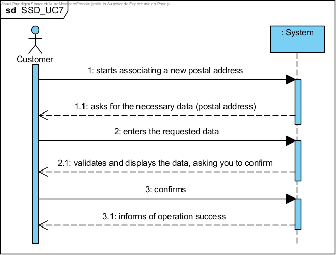

UC7 - Associate Postal Address to Customer
==============================

Short Format
-------------

The customer starts associating a new postal address with your information. The system asks for the necessary data (postal address). The customer enters the requested data. The system validates and displays the data, asking you to confirm it. The customer confirms. The system **associates the postal address with the customer** and informs him of the success of the operation.

SSD
---

Complete Format
----------------

### Lead actor

Customer

### Stakeholders and their interests

- **Client:** wants to associate a new address to his address book.

- **Company:** you want the client to be able to request services for any of your addresses.

### Preconditions

(Being authenticated in the system as a client.)

### Post-conditions

The customer's address is stored in the system.

Main success scenario (or basic flow)
----------------------------------------------

1.  The customer starts associating a new postal address with his information.
2.  The system requests the necessary data (i.e. postal address).
3. The Customer enters the requested data.
4. The system validates and displays the data, asking you to confirm it.
5. The Client confirms.
6. The system **associates the postal address with the customer** and informs him of the success of the operation
    

### Extensions (or alternative flows)

\*a. The Client requests the cancellation of the registration.

> The case of use ends.

4a. Minimum mandatory data missing.

> The system informs you which data is missing.

> The system allows the entry of the missing data (step 2)

> 2a. The Client changes the data. The use case ends.

4b. The system detects that the data (or a subset of the data) you have entered must be unique and already exist in the system.

> The system alerts the Client to this fact.

> The system allows you to change them (step 2)

> The Client does not change the data. The use case ends.

4c. The system detects that the data entered (or a subset of the data)
is invalid.

> The system alerts the Client to this fact.

> The system allows you to change them (step 2).

> 2a. The Client does not change the data. The use case ends.

### Special requirements

\-

### List of Technology and Data Variations

\-

### Frequency of Occurrence

\-

### Open questions

- What data together allow for the detection of duplication of addresses?
- Should the customer have a preferred postal address?
- How often does this use case occur?

