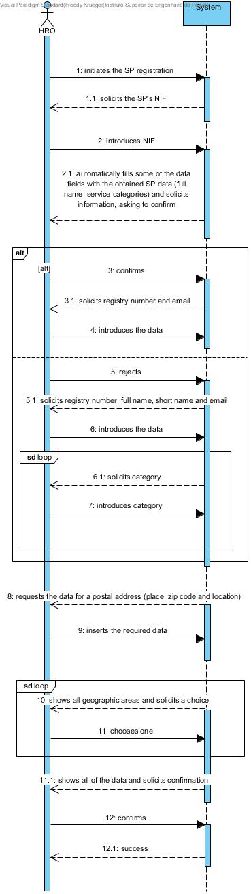

# UC8 - Service Provider Registration

## Short format 

The HRO begins registering the new Service Provider. The system solicits the SP's NIF. The HRO introduces the NIF. The system retrieves the available information from the Service Provider Candidature (full name, short name and service categories), shows it to the HRO, and asks if he'd like to keep it or insert it anew. The HRO confirms, the system requests the remaining data (registry number and email), and the HRO inserts it. Alternatively, the HRO rejects it, the system requests some data (full name, short name, registry number and email), the HRO inserts it, the system requests at least one category, the HRO inserts at least one). The system shows a list of existing geographic areas requests a choice of a least one. The HRO chooses at least one. The system shows the data and asks for confirmation. The HRO confirms. The system wraps up the use case.

## SSD

## Complete format

### Main actor

HRO (Human Resources)

### Interested parties and their motivations

* **HRO** intends to register the Service Providers so they are available to service Company's clients.
* **Company** intends to have Service Providers available to service it's clients.
* **Service Provider** intends to have a profile so he can indicate his availability in order to start servicing.

### Initial restrictions 
The system should have service categories and geographic areas

### Final restrictions 
Registry information is saved to the system.

## Main success scenario (principal flow)

1. The HRO begins registering the new Service Provider
2. The system solicits the SP's NIF
3. The HRO introduces the NIF
4. The system retrieves the available information from the Service Provider Candidature (full name and service categories), shows it to the HRO, and asks if he'd like to keep it or insert it anew
5. The HRO confirms
6. The system requests the remaning data (short name, registry number and email)
7. The HRO inserts it
8. Alternatively, the HRO rejects it
9. The system requests some data (full name, short name, registry number and email)
10. The HRO inserts it
11. The system requests a category
12. The HRO inserts at least one
13. Steps 11 and 12 repeat themselves while the HRO wishes to introduce other categories
14. The system requests data required for a postal address (place, zip code and location)
15. The HRO inserts the requested data.
16. The system shows a list of existing geographic areas requests a choice of one
17. The HRO chooses one.
18. Steps 14 and 15 repeat themselves while the HRO wishes to choose other geographic areas
19. The system shows the data and asks for confirmation
20. The HRO confirms
21. The system wraps up the use case and registers the Service Provider

### Extensions (or alternative flows)

*a. The HRO cancels the registration 

> The use case ends 

7a. Duplicated/Incomplete registry number and/or email 
>	1. The system informs the HRO.
>	2. The system permits the introduction of new data
>
	>	2a. The HRO does not change the data, the use case ends

10a. Duplicated/Incomplete registry number and/or email and/or full name and/or short name
>	1. The system informs the HRO.
>	2. The system permits the introduction of new data
>
	>	2a. The HRO does not change the data, the use case ends

12a. Duplicated/Incomplete category data
>	1. The system informs the HRO.
>	2. The system permits the introduction of new data
>
	>	2a. The HRO does not change the data, the use case ends

175. Duplicated/Incomplete postal address data
>	1. The system informs the HRO.
>	2. The system permits the introduction of new data
>
	>	2a. The HRO does not change the data, the use case ends

17a. Duplicated/Incomplete geographic area data
>	1. The system informs the HRO.
>	2. The system permits the introduction of new data
>
	>	2a. The HRO does not change the data, the use case ends

19a. Duplicated data during the use case validation 
>	1. The system informs the HRO.
>	2. The system permits the introduction of new data
>
	>	2a. The HRO does not change the data, the use case ends

19b. Incomplete data during the use case validation 
>	1. The system informs the HRO.
>	2. The system permits the introduction of new data
>
	>	2a. The HRO does not change the data, the use case ends

### Special requirements 
\-

### List of variations in technology and data
\-

### Frequency of occurrence
\-

### Unanswered questions

* Which data allow us to detect duplicate Service Providers?
* What are the security rules regarding login data?
* How often does this use case occur?