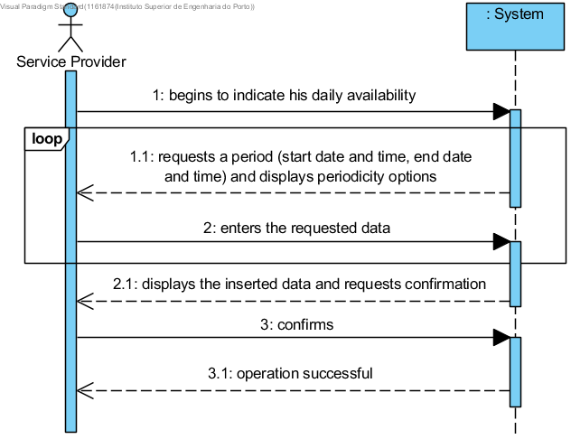

# UC9 - Indicate Daily Availability

## Short Format

The service provider begins to indicate his daily availability. The system requests the necessary data (i.e. start and end date/time). The service provider enters the requested data. The system validates, displays the data to the service provider and requests confirmation. The service provider confirms. The system saves the availability of the service provider and informs him of the operation success.

## SSD

## Complete Format

### Primary actor
Service Provider

### Stakeholders and their interests
* **Service Provider:** wants to indicate his daily availabilities to perform services.

* **Company:** wants the daily availabilities of the service providers to be specified in the system.

### Preconditions
n/a

### Post-conditions
The information on the service provider's daily availability is registered in the system.

## Main success scenario (or basic flow)

1. The service provider begins to indicate his daily availability.
2. The system requests a period (start date and time and end date and time) in which the service provider is available to perform services and displays periodicity options.
3. The service provider enters the requested data.
4. The system validates, displays the inserted data and requests confirmation.
5. The service provider confirms.
6. The system register the availability period of the service provider and informs the service provider of the operation success.
7. Steps 2 to 6 are repeated until the service provider has indicated all availability.

### Extensions (or alternative flow)

*a. The service provider requests the cancellation of the application.
>	The use case is over.

4a. Data from the availability period is incomplete.
>   1. The system displays which data is missing.
>	2. The system allows the missing data to be entered (step 3).
>
	>	2a. The service provider doesn't change the data. The use case ends.

4b. The system detects there's data (or some subset of data) entered that's invalid.
>   1. The system alerts the service provider.
>	2. The system allows to change the data (step 3).
>
	>	2a. The service provider doesn't change the data. The use case ends.
	
4c. The system detects that the indicated availability overlaps (i.e. intersects) 
with other previously indicated availability.
>   1. The system alerts the service provider.
>	2. The system allows to change the data (step 3).
>
	>	2a. The service provider doesn't change the data. The use case ends.

### Special requirements
\-

### Technology and data variations list
\-

### Frequency of occurrence
\-

### Open issues
\-
