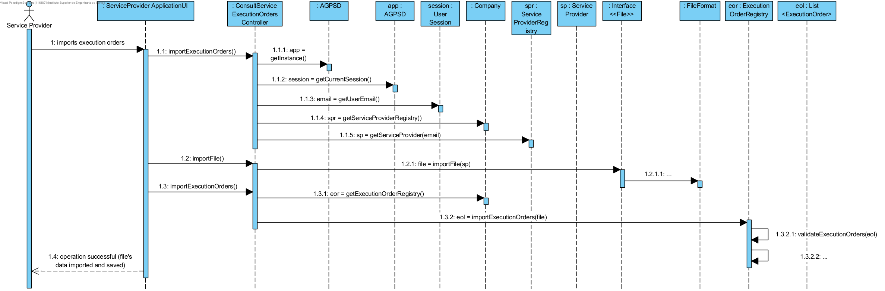
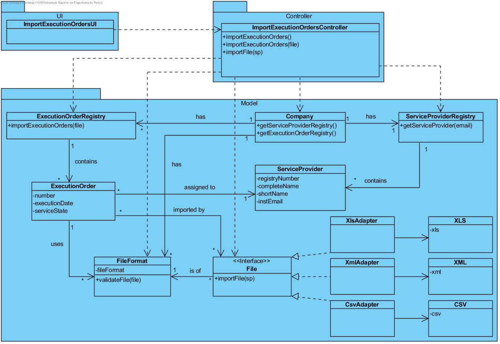

# Execution of UC 1 - Import Execution Orders

## Rationale

| Basic Flow | Question: Which Class... | Answer | Justification |
|:-------------------------------------------------------------------------------------------------------|:------------------------------------------------------------|:-----------------------------------------------|:---------------------------------------------------------------------------------------------------------------------|
|1. The service provider imports execution orders.|...interacts with the user?| ServiceProviderApplicationUI | Pure Fabrication |
||...coordinates the UC?| ServiceProviderApplicationController | Controller |
||...knows the ServiceProvider class?| ServiceProviderRegistry | HC + LC |
||...knows the ServiceProviderRegistry class?| Company | HC + LC - The Company delegates it's responsibility (earned by applying Creator - Rule 1) to ServiceProviderRegistry by applying HC+LC.|
|2. The system imports the execution orders and informs the service provider of the operation success.|...validates de file?| FileType | Information Expert (IE) - FileFormat knows all available file formats. |
||...saves the imported data?| ExecutionOrderRegistry | IE - The execution orders are assigned to ServiceProvider. |

## Systematization

The conceptual classes promoted to software classes in result of the rationale are:

 * Company
 * ServiceProvider
 * ExecutionOrder

Other identified software classes (i.e. Pure Fabrication):

 * ServiceProviderApplicationUI
 * ServiceProviderApplicationController
 * ServiceProviderRegistry
 * ExecutionOrderRegistry

##	Sequence Diagram

##	Class Diagram

