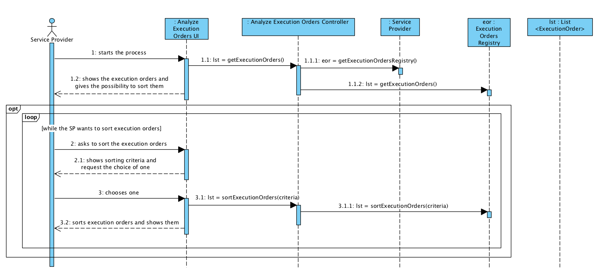
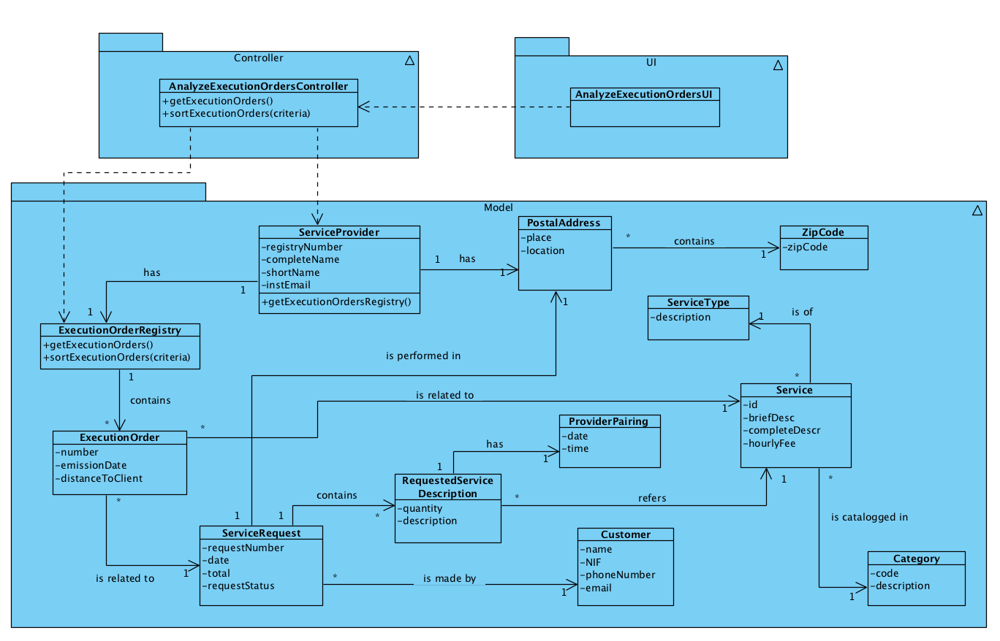

# Execution of UC 2 - Analyze Execution Orders

## Rationale

| Basic Flow | Question: Which Class... | Answer | Justification |
|:-------------------------------------------------------------------------------------------------------|:------------------------------------------------------------|:-----------------------------------------------|:---------------------------------------------------------------------------------------------------------------------|
| 1. The service provider (SP) starts the process. | ...interacts with the user? | AnalyzeExecutionOrdersUI | PureFabrication, as it is not justifiable for any other Domain Model (DM) class to have that responsibility. |
|| ...coordinates the UC? | AnalyzeExecutionOrdersController | Controller |
| 2. The system shows the execution orders and gives the possibility to sort them. | ...knows the execution orders? | ExecutionOrdersRegistry | Information Expert (IE): in the Domain Model (DM), the ServiceProvider has ExecutionOrder. Through the application of HC + LC, it delegates the task to ExecutionOrdersRegistry. |
| 3. The service provider asks to sort the execution orders. ||||
| 4. The system shows sorting criteria and requests the choice of one (i.e. customer's name, distance from SP facilities to customer's home, service category, service start date and time, type of service, customer's address). ||||
| 5. The service provider chooses one. ||||
| 6. The system sorts the execution orders and shows them. | ...has the information necessary to sort the execution orders? | ExecutionOrdersRegistry | IE + HC + LC: ExecutionOrdersRegistry knows the execution orders, which have information required for all sorting criterias. |
||| ServiceProvider | IE: In the Domain Model (DM), ServiceProvider knows its postal address (in order to sort by distance from SP facilities to customer's home). 
| 7. The steps 3 to 6 are optional and can be done more than once (while the service provider wants it). |||| 

## Systematization

 From the rationale, we get that the conceptual classes promoted to software classes are:

 * ExecutionOrder
 * ServiceProvider

Other software classes (i.e. Pure Fabrication) identified: 

 * AnalyzeExecutionOrdersUI
 * AnalyzeExecutionOrdersController
 * ExecutionOrdersRegistry

##	Sequence Diagram

##	Class Diagram

