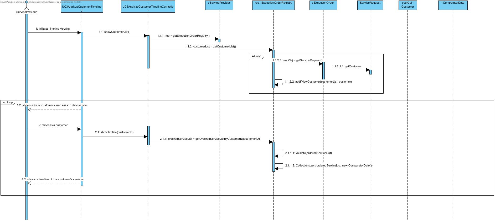
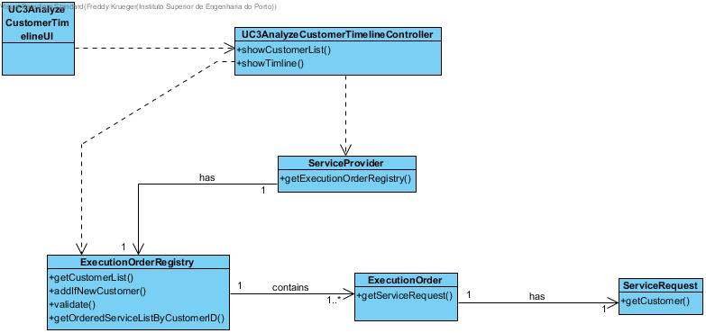

# Execution of UC 3 Analyze Customer Timeline

## Rationale

| Main Flow | Question: Which Class... | Answer | Justification |
|:-------------------------------------------------------------------------------------------------------|:------------------------------------------------------------|:-----------------------------------------------|:---------------------------------------------------------------------------------------------------------------------|
|1. The Service Provider begins viewing the timeline |... interacts with the user?|UC3AnalyzeCustomerTimelineUI|MVC - PureFabrication|
||...coordinates the UC?|UC3AnalyzeCustomerTimelineController|MVC - PureFabrication| 
|2. The system shows a list of customers and asks the Service Provider to choose one| ...has the ExecutionOrders? | ExecutionOrderRegistry | IE |
||...is taked with getting the customer list? | ExecutionOrderRegistry | Holds the list of ExecutionOrders from which we get the Request and then the Customer - IE |
|3. The Service Provider Chooses a customer | 
|4. The system shows the timeline of services for that customer, including the Service Provider which provided the service | ...is tasked with forming the ordered list of services? | ExecutionOrderRegistry | IE |
|5. Steps 2 through 4 repeat themselves while the Service Provider wishes to see the timeline of other customers  ||||                                     

## Systematization ##

The conceptual classes promoted to software classes in result of the rationale are:

 * ServiceProvider
 * ExectionOrder
 * ServiceRequest
 * Customer

Other identified Software classes (i.e. Pure Fabrication):  

 * UC3AnalyzeCustomerTimelineUI  
 * UC3AnalyzeCustomerTimelineController
 * ExectionORderRegistry
 * ComparatorDate

##	Sequence Diagram

##	Class Diagram

