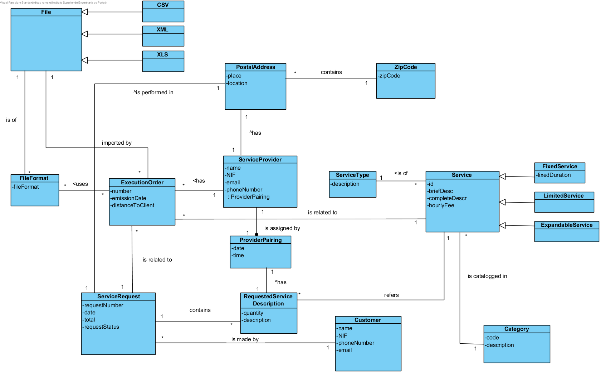

# OO Analysis #
The construction process of the domain model is based on the use cases, especially the nouns used and the assignment's details.
## Rationale to identification of domain model's classes ##
The following categories list is based on the material from ESOFT classes and is used as a way to identify the domain model's classes.

### _Categories List_ ###

**Transactions (of the business)**

* Execution Order

---

**Transaction lines**

* Requested Service Description
* Execution Order  

---

**Transaction lines**

*  Service
*  Expandable Service
*  Fixed Service
*  Limited Service

---

**Records (of transactions)**

*  

---  

**People's roles**

* Service Provider

---

**Places**

*  Geographic Area
*  Postal Address
*  Zip Code

---

**Events**

* 

---

**Physical objects**

* 

---

**Specifications and descriptions**

*  Service Type
*  File
*  File Format

---

**Catalogs**

*  

---

**Sets**

*

---

**Elements Sets**

*  

---

**Organizations**

*  

---

**Other systems (external)**

* 

---

**Records (financial), of labour, contracts, legal documents**

* 

---

**Financial instruments**

*  

---

**Referred documents/to perform the tasks/**

*    

---

###**Rationale on identification of associations between classes**###

An association is a relationship betwween instances of objects that indicates a relevant connection that is worth mentioning or is a derivative of the list of common associations.

+ A is physically or logically  a part of B.
+ A is physically or logically contained in B.
+ A is a description of B.
+ A is known/captured/processed by B.
+ A uses or generates B.
+ A is related to a transaction of B + etc.

| Concept (A) 		                |  Association   		            |  Concept (B) |
|----------	   		                |:-------------:		            |------:       |
| Execution Order	                | is related to     	            | Service Request|
|   				                | is related to         	        | Service  |
|				    	            | imported by   	                | File |
|                                   | uses                              | File Format |
| Postal Address                    | contains      	                | Category  |
| Requested Service Description	    | refers                            | Service |
| Service		                    | is of    		                    | Service Type |
|       		                    | is catalloged in    		        | Category |
| Fixed Service		                | is a specialization of            | Service  |
| Limited Service		            | is a specialization of            | Service  |
| Expandable Service		        | is a specialization of            | Service  |
| Service Provider				    | has          	                    | Postal Address  |
|               				    | has          	                    | Execution Order |
| Service Request				    | is made by          	            | Customer |
|               				    | contains          	            | Service Request Description|
|               				    | is performed in         	        | Postal Address|

**Note:** The external service provides the distance for zip codes. Each pair of information Distance + Zip Code is used to establish the association "acts on" between GeographicalArea and ZipCode.

## Domain Model

