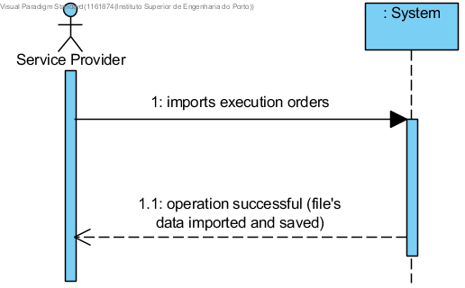

# UC 1 - Import Execution Orders

## Short Format

The service provider imports execution orders. The system imports the execution orders and informs the service provider of the operation success.

## SSD

## Complete Format

### Primary actor
Service Provider

### Stakeholders and their interests
* **Service Provider:** wants to use the Service Provider Application with the imported execution orders.
* **Company:** allow the service provider to use the Service Provider Application.

### Preconditions
Authentication as a Service Provider.

### Post-conditions
The system runs the application with the newly imported execution orders.

## Main success scenario (or basic flow)

1. The service provider imports execution orders.
2. The system imports the execution orders and informs the service provider of the operation success.

### Extensions (or alternative flow)

4a. The system detects an invalid file.
>   1. The system alerts the service provider.
>	2. The system allows to change the file (step 1).
>
	>	2a. The service provider doesn't change the file. The use case ends.
	
4b. The system detects there's data (or some subset of data) in the file that's invalid.
>   1. The system alerts the service provider.

### Special requirements
\-

### Technology and data variations list
\-

### Frequency of occurrence
\-

### Open issues
\-