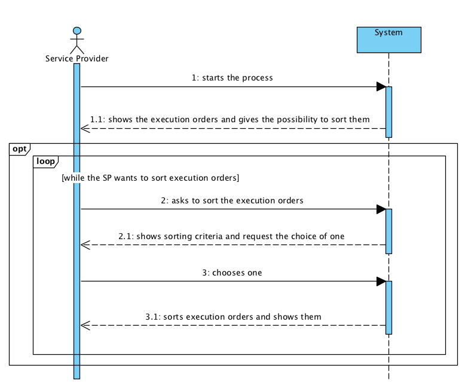

# UC 2 - Analyze Execution Orders

## Short Format

The service provider starts the process. The system shows the execution orders and gives the possibility to sort them. The service provider asks to sort the execution orders. The system shows sorting criteria and request the choice of one. The service provider chooses one. The system sorts the execution orders and shows them. Sorting the execution orders is optional and can be done more than once (while the service provider wants it).

## SSD

## Complete Format

### Primary actor

Service Provider

### Stakeholders and their interests
* **Service Provider:** wants to see and sort the execution orders.

### Preconditions
Importing the execution orders or having some saved in memory.

### Post-conditions
\-

## Main success scenario (or basic flow)

1. The service provider (SP) starts the process.
2. The system shows the execution orders and gives the possibility to sort them.
3. The service provider asks to sort the execution orders.
4. The system shows sorting criteria and request the choice of one (i.e. customer's name, distance from SP facilities to customer's home, service category, service start date and time, type of service, customer's address).
5. The service provider chooses one.
6. The system sorts the execution orders and shows them.
7. The steps 3 to 6 are optional and can be done more than once (while the service provider wants it).

### Extensions (or alternative flow)
*a. The administrator requests the cancellation of the execution orders analysis.

> The use case ends.

4a. The system can't sort the execution orders by the selected criterion.
> 1. The system alerts the service provider.
  2. The system shows the execution orders unsorted.

### Special requirements
\-

### Technology and data variations list
\- 

### Frequency of occurrence
\-

### Open issues
\-
