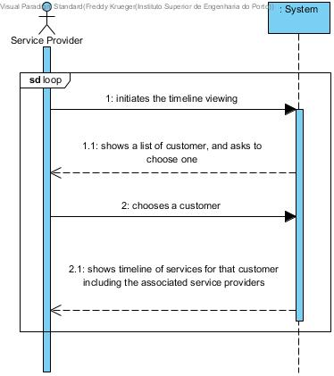

# UC3 - Analyze Customer Timeline

## Brief Format

The Service Provider begins viewing the timeline. The system shows a list of customers and asks the Service Provider to choose one. The Service Provider Chooses a customer. The system shows the timeline of services for that customer, including the Service Provider which provided the service. 

## SSD

## Complete Format

### Main Actor
Service Provider

### Interested parties and their motivations
* **Service Provider** wishes to view the timeline of services for one or more clients

### Initial restrictions 
The system should have at least one customer 

### Final restrictions
n/a 

## Main success scenario (principal flow)

1. The Service Provider begins viewing the timeline
2. The system shows a list of customers and asks the Service Provider to choose one
3. The Service Provider Chooses a customer
4. The system shows the timeline of services for that customer, including the Service Provider which provided the service
5. Steps 2 through 4 repeat themselves while the Service Provider wishes to see the timeline of other customers

### Extensions (or alternative flows)

*a. The Service Provider cancels the viewing of the timeline

> The use case ends 

2a. There are no customers to show
>	1. The system informs the Service Provider.
>	2. The use case ends

4a. Incomplete data/no customers introduced 
>	1. The system informs the Service Provider.
>	2. The system permits the introduction of new data
>
	>	2a. The Service Provider does not change the data, the use case ends

### Special requirements 
\-

### List of variations in technology and data
\-

### Frequency of occurrence
\-

### Unanswered questions

* How often does this use case occur?
* How should the timeline be shown?
* Can the service provider have options to apply more filters to the timeline?