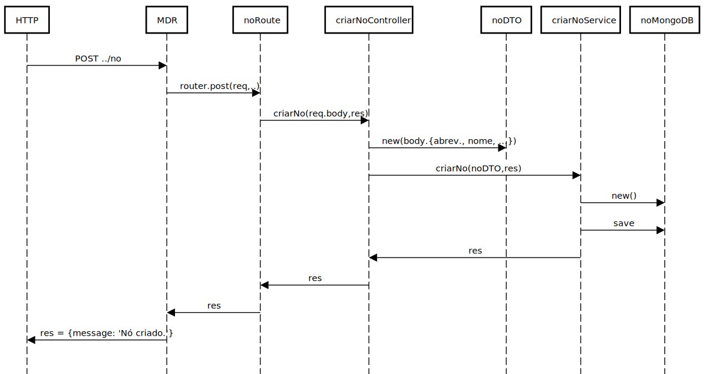

**US_MDR_02 - Criar um nó**
=======================================

# 1. Requisitos

**US_MDR_02** Como data administrator, quero criar nós da rede indicando o seu nome, se é ou não uma estação de recolha ou ponto de rendição e as suas coordenadas.

## 1.1 Requisitos adicionais do cliente

--

# 2. Análise

## 2.1. Glossário de conceitos

* **Data Administrator**: utilizador do caso de uso. É ele o responsável por definir um percurso no sistema.
* **Nó**: ponto da rede de transportes com importância para o processo de planeamento. Exemplos de nós são estações de recolha, términos, e paragens ao público.

## 2.2. Modelo de domínio

Classes correspondentes a entidades do domínio:
* **Nó**
	* Value objects relacionados:
		* Abreviatura
		* Nome
		* Latitude
		* Longitude

O modelo de domínio deve sofrer as seguintes alterações, de forma a acomodar os novos requisitos que entretanto surgiram:
* Latitude e longitude devem ser atributos do Nó e não de Coordenadas. Não estaria errado, mas por razões de simplificação (e enquadramento com os novos requisitos), é a melhor opção neste momento.
* Adição de Nome ao Nó.

## 2.3. Regras de negócio

* Value objects:
	* Abreviatura (obrigatório)(único): código alfanumérico, máx. 20 caracteres;
	* Nome (obrigatório): alfanumérico, máx. 200 caracteres;
	* Latitude (obrigatório): no formato WGS84;
	* Longitude (obrigatório): no formato WGS84;

# 3. Design

## 3.1. Realização da Funcionalidade

* Por motivos de simplificação, optou-se também por incluir como atributos:
	* EstacaoRecolha (obrigatório): booleano (true/false);
	* PontoRendicao (obrigatório): booleano (true/false);

O fluxo que permite realizar esta funcionalidade pode ser descrito através do diagrama seguinte:

## 3.2. API call

### Criar Nó

* Endpoint:	`/api/no`
* Method: *POST*
* Body:
	* Media type: *application/json*
	* Type: *object*
	* Properties:
		* **abreviatura**: string (required)
		* **nome**: string (required)
		* **latitude**: number (required)
		* **longitude**: number (required)
		* **estacaoRecolha**: boolean (required)
		* **pontoRendicao**: boolean (required)

## 3.3. Padrões Aplicados

Os padrões utilizados podem ser enquadrados nos seguintes:
* GRASP: Controller, Creator, Information Expert, High Cohesion, Low Coupling
* SOLID: Single-responsibility principle

## 3.4. Testes

* Testes unitários recorrendo ao Jest:
 * No (model):
 	* Criação de novo modelo Nó;
	* Validação de cada atributo criado;
	* Validação de objetos iguais com atributos iguais;
	* Validação de instância do objeto criado;
	* Validação de tipo de campos correto

* Testes funcionais (Postman), recorrendo à API call apresentada acima.
	* Para verificar a o resultado da criação dos nós recorreu-se diretamente à BD. Em vez disso, devem criar-se novas calls (Get Nó, Delete Nó e Put Nó), para testar de forma mais automática.

# 4. Implementação

* As validações das regras de negócio foram feitas recorrendo a validações do Mongoose (noMongoDB). No entanto, faria mais sentido fazê-las no No (model), uma vez que devem ser da camada de domínio. Para tal, pode recorrer-se ao módulo Joi do JS.
* Em termos de validação das coordenadas (não é de negócio), uma implementação mais correta seria usar o schema Point de geoJSON para Mongoose: https://mongoosejs.com/docs/geojson.html

# 5. Integração/Demonstração

# 6. Observações
