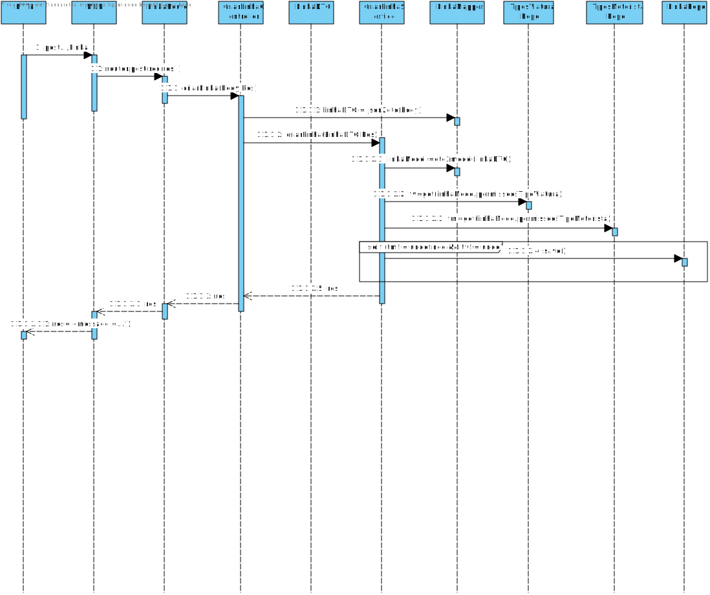
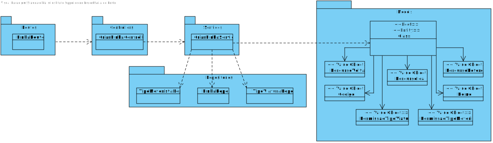

**US_MDR_03 - Criar uma linha**
=======================================

# 1. Requisitos

**US_MDR_03** - Como data administrator, quero criar linha indicando o seu código (ex., “C”), nome (ex., “Linha Verde”) e o  seu  nó  terminal(ex., Campanhã, ISMAI),  bem  como  eventuais  restrições sobre  o  tipo  de  viatura e tipo de tripulante.

## 1.1 Requisitos adicionais do cliente

Ter conhecimento dos tipos de viaturas, tipos de triulantes e percursos já existentes no sistema.

# 2. Análise

## 2.1. Glossário de conceitos

* **Data Administrator**: utilizador do caso de uso. É ele o responsável por definir um percurso no sistema.
* **Linha**: Uma linha corresponde a um conjunto de percursos. Uma linha terá, pelo menos, dois percursos em sentidos opostos. Por vezes poderá ter percursos alternativos que permitem reforçar a oferta em algumas das áreas cobertas pela linha, ex., a linha C do Metro do Porto tem o percurso Campanhã-ISMAI mas também o percurso Campanhã-Fórum Maia.
* **Tipo de Viatura**: Usada para classificar as diversas viaturas do sistema. 
* **Tipo de Motorista**: Usada para classificar os diversos motoristas do sistema. 

## 2.2. Modelo de domínio

Classes correspondentes a entidades do domínio:
* **Linha**
	* Value objects relacionados:
		* Código
		* Nome
		* PermissoesMotoristas(Lista)
		* PermissoesViaturas(Lista)
		* NoFInal

## 2.3. Regras de negócio

* Value objects:
	* Codigo : 
	* Nome (obrigatório): alfanumérico, máx. 200 caracteres.
	* PermissoesMotoristas : referencias a tipos de motoristas ja existentes no sistema.
	* PermissoesViaturas : referencias a tipos de viaturas ja existentes no sistema.
	* Nofinal
	* 
# 3. Design

## 3.1. Realização da Funcionalidade

* Verificar se os percursos referenciados existem no sistema e se já estão a ser usados em outras linhas.
* Verificar se nesses percursos temos no minimo um na orientação de ida e outro na orientação de volta.
* Ao introduzirmos as referencias dos tipos de viaturas e tipos de motoristas, a existencia dos mesmos irá ser verificada.
* Caso não exista nenhum dos objetos referidos nos dois pontos acima, o sistema cancela a criação da linha e informa o utilizador qual a razão da falha.

O fluxo que permite realizar esta funcionalidade pode ser descrito através do diagrama seguinte:

## 3.2. Diagrama de Classes

## 3.3. Padrões Aplicados

Os padrões utilizados podem ser enquadrados nos seguintes:
* GRASP: Controller, Creator, Information Expert, High Cohesion, Low Coupling
* SOLID: Single-responsibility principle

## 3.4. Testes

* Testes unitários realizados no jest.

### 3.4.1 Planeamento

# 4. Implementação

*Nesta secção a equipa deve providenciar, se necessário, algumas evidências de que a implementação está em conformidade com o design efetuado. Para além disso, deve mencionar/descrever a existência de outros ficheiros (e.g. de configuração) relevantes e destacar commits relevantes;*

*Recomenda-se que organize este conteúdo por subsecções.*

# 5. Integração/Demonstração

# 6. Observações
