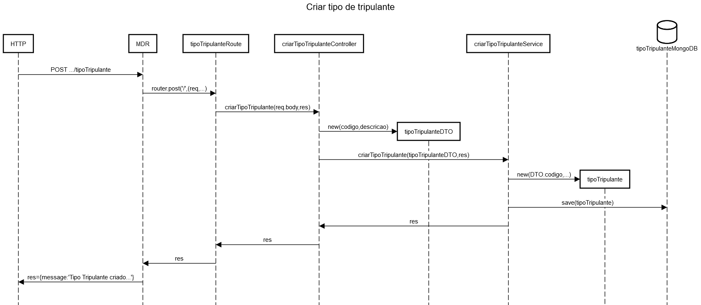
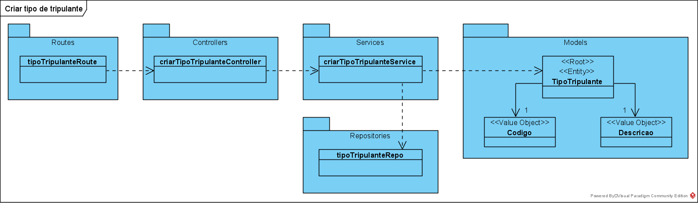

**US_MDR_05 - Criar tipo de tripulante** *(requisito nº 5)*
=======================================

# 1. Requisitos

**US_MDR_05** - Como data administrator, quero criar tipo de tripulante, ex., "motorista sénior com conhecimento de línguas estrangeiras".

Um tipo de tripulante é uma descrição livre (não catalogada) de características.

> _A implementação desta user story não requer uma divisão em mais casos de uso._

# 2. Análise

O **Tipo de Tripulante** trata-se de uma descrição com uma ou mais características do tripulante (motorista).

Por exemplo: A linha do aeroporto só pode ser tripulada por **motoristas que saibam falar inglês**.


## 2.1. Glossário de conceitos e Contexto
* **Data Administrator**: utilizador da user story. Responsável por aceder ao sistema para definir um tipo de tripulante.
* **Tipo de Tripulante**: descrição livre (não catalogada) de características do tripulante (motorista).

## 2.1.1. Caracterização de Tipo de Tripulante:
* **Código**;
* **Descrição** livre de características.

## 2.2. Regras de negócio / Outros requisitos

Um tipo de tripulante tem um código e uma descrição (alfanuméricos com 20 e 250 caracteres no máximo, respetivamente), campos estes de preenchimento obrigatório.

```xml
<DriverTypes>
<DriverType key="" name="" description="" />
</DriverTypes>
```

# 3. Design

Implementação de acordo com a estrutura base da aplicação.

## 3.1. Realização da Funcionalidade

O fluxo que permite realizar esta funcionalidade pode ser descrito através do diagrama seguinte:


[Raw file](./US_MDR_05_SD.md)

### 3.1.1. **Classes correspondentes a entidades do domínio**:

Agregado TipoTripulante

|**Entity** |**Value Object**  |
|---------|---------|
| TipoTripulante | CodigoTipoTripulante |
|    | DescricaoTipoTripulante |

## 3.2. Diagrama de Classes



## 3.3. Padrões Aplicados

Padrões já definidos no 2. do [Readme](../../README.md), em _Aspetos Gerais, Arquitetura e Design do Sistema_.

## 3.4. Testes

### 3.4.1. Testes Unitários

* Testar a obrigatoriedade dos atributos definidos em 2.1.1 - NotNull/NotEmpty.
* Testar tamanho do código e descrição de tipo de tripulante - 20 e 250 caracteres no máximo, respetivamente.
* Testar a funcionalidade de cada function principal (criarTipoTripulante, obterTipoTripulante, entre outros).

### 3.4.2. Testes de Integração

* Controller -> Service + Mapper -> Repository

## 3.4.3. Testes e2e

* POST -> criar um tipo de tripulante
* GET -> listar um tipo de tripulante
* UPDATE -> alterar um tipo de tripulante
* DELETE -> apagar um tipo de tripulante

> Plataforma utilizada no MDR: Postman

> Plataforma utilizada no SPA: Cypress

# 4. Integração/Demonstração

Realizar Testes unitários, de integração e e2e em conformidade.

Módulo Master Data Rede - Integração no sistema OPT:

* [SPA](https://bitbucket.org/pvpmagalhaes1/20s5-3na-2spa/src/master)

* [Master Data Viagem](https://bitbucket.org/pvpmagalhaes1/20s5_3na_2mdv/src/master/)

* [Planeamento](https://bitbucket.org/pvpmagalhaes1/20s5_3na_2/src/master/Planeamento/)

# 5. Observações

Juntamente com os tipos de viaturas, os tipos de tripulantes são necessários ter em conta no planeamento e gestão da rede.

### [**Voltar para o Índice de User Stories**](../us.md)
