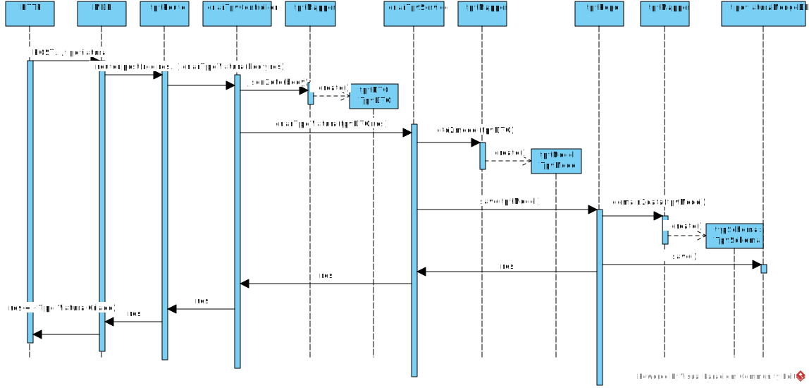
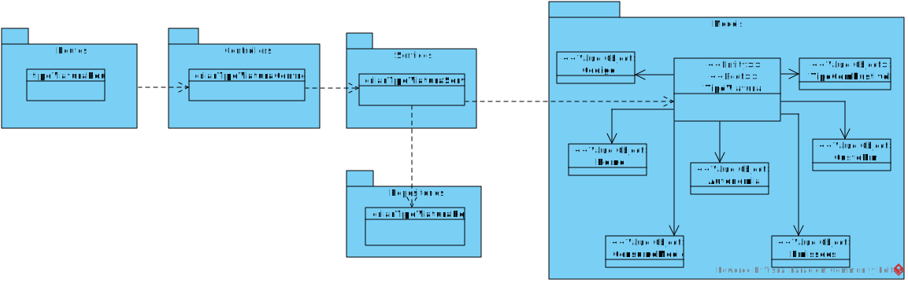

**US_MDR_06 - Criar tipo de Viatura**
=======================================

# 1. Requisitos

**US_MDR_06** Como data administrator, quero criar tipo de viatura (ex., “minibus a gasóleo”), indicando o seu tipo de combustível (i.e., Diesel, Gasolina, Elétrico, GPL, Gás), autonomia, custo por quilómetro, consumo médio e velocidade média..

## 1.1 Requisitos adicionais do cliente

* Custo por Kilometro é monetario e assumido em Euro mas tb podem deixar aberta a possibilidade de suportar diferentes moedas.

# 2. Análise

## 2.1. Glossário de conceitos

* **Data Administrator**: É o utilizador do caso de uso; É responsavel por criar o tipo de viatura.
* **Tipo de Viatura**: Carateriza um tipo de viatura (i.e., Diesel, Gasolina, Elétrico, GPL, Gás), que integra uma determinada linha.
* **Linha**: Uma linha corresponde a um conjunto de percursos Uma linha terá, pelo menos, dois percursos em sentidos opostos. Por vezes poderá ter percursos alternativos que permitem reforçar a oferta em algumas das áreas cobertas pela linha

## 2.2. Modelo de domínio

Classes correspondentes a entidades do domínio:
* **Tipo Viatura** (aggregate root - TipoViatura)
	* Value objects relacionados:
		* CodigoViatura
		* DescricaoViatura
		* TipoCombustivel
		* Autonomia
		* VelocidadeMedia
		* CustoKm
		* ConsumoMedio
		* Emissoes

## 2.3. Regras de negócio

* Value Objects:
	* Código (obrigatório) (único): código alfanumerico de máximo 20 caracteres
	* Nome (obrigatório): alfanumerico, máximo 250 carateres;
	* TipoCombustivel (obrigatório): fixo e uma desta 5 opções (gasolina, diesel, gas, electrico e gpl)
	* Autonomia
	* VelocidadeMedia: inteiro positivos;
	* CustoKm: monetário não negativo em euros, podendo haver a possibilidade de ser em outra moeda;
	* ConsumoMedio: é um número decimal com 3 casas decimais cuja unidade vai depender do tipo de combustivel, ex., gasoleo l/100Km enquanto que um veiculo eletrico será Kw/10Km
	* EmissoesCO2 .

# 3. Design

## 3.1. Realização da Funcionalidade

Com base requisitos fornecidos pelo cliente, salientam-se as seguintes decisões:
* Devem estar pré-definidas os tipos de combustivel previstos pelo cliente, assim como cada unidade de medida referente ao consumo médio
* A selecão da moeda é caracterizado em variaveis da aplicação

 "Diagrama de Sequência - Criar Tipo Viatura")

## 3.2. Diagrama de Classes

## 3.3. Padrões Aplicados

Os padrões utilizados podem ser enquadrados nos seguintes:
* GRASP: Controller, Creator, Information Expert, High Cohesion, Low Coupling
* SOLID: Single-responsibility principle, Dependency Inversio

## 3.4. Testes

Utilização do Postman para
* POST -> criar um tipo de viatura
* GET -> Obter os elementos de um tipo de viatura
* DELETE -> apagar o tipo de viatura

* Testes unitários recorrendo ao Jest:
 * TipoViatura (model):
 	* Criação de novo modelo TipoViatura;
	* Validação de cada atributo criado;
	* Validação de objetos iguais com atributos iguais;
	* Validação de instância do objeto criado;
	* Validação de tipo de campos correto

### 3.4.1 Planeamento

# 4. Implementação

# 5. Integração/Demonstração

# 6. Observações

