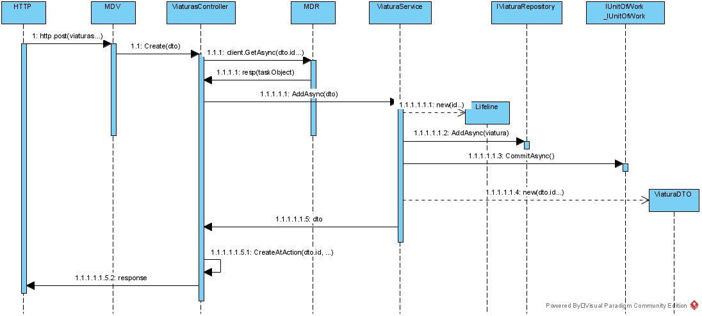

**US40 - Criar Viatura** *(requisito nº 11)*
=======================================

# 1. Requisitos

**US40** Como data administrator, quero criar uma viatura 

## 1.1 Requisitos adicionais do cliente

# 2. Análise

## 2.1. Glossário de conceitos

* **Data Administrator**: É o utilizador do caso de uso; É responsavel por criar o tipo de viatura.
* **Tipo de Viatura**: Carateriza um tipo de viatura (i.e., Diesel, Gasolina, Elétrico, GPL, Gás), que integra uma determinada linha.
* **Viatura**: viatura

## 2.2. Modelo de domínio

Classes correspondentes a entidades do domínio:
* **Tipo Viatura** (aggregate root - TipoViatura)
	* Value objects relacionados:

		* Viatura

		 matricula é o identificador de negócio da viatura 

## 2.3. Regras de negócio

Uma viatura tem uma **matricula** e outros atributos com regras ou requisito especificados pelo cliente
  * Matricula (obrigatorio) a matricula é o identificador de negócio da viatura
  * VIN
  * Tipo de Viatura 
  * Data Entrada ao serviço. 
	

https://en.m.wikipedia.org/wiki/Vehicle_identification_number	- 
It required all on-road vehicles sold to contain a 17-character VIN, which does not include the letters O (o), I (i), and Q (q) (to avoid confusion with numerals 0, 1, and 9).

# 3. Design

## 3.1. Realização da Funcionalidade
O fluxo que permite realizar esta funcionalidade pode ser descrito através do diagrama seguinte:

O fluxo que permite realizar esta funcionalidade pode ser descrito através do diagrama seguinte:

## 3.2. Diagrama de Classes

## 3.3. Padrões Aplicados

Os padrões utilizados podem ser enquadrados nos seguintes:
* GRASP: Controller, Creator, Information Expert, High Cohesion, Low Coupling
* SOLID: Single-responsibility principle, Dependency Inversio

## 3.4. Testes

Utilização do Postman para
* POST -> criar um tipo de viatura
* GET -> Obter os elementos de um tipo de viatura
* DELETE -> apagar o tipo de viatura

* Testes unitários recorrendo ao Jest:
 * TipoViatura (model):
 	* Criação de uma nova viatura;
	* Validação de cada atributo criado;
	* Validação de objetos iguais com atributos iguais;

### 3.4.1 Planeamento

# 4. Implementação

# 5. Integração/Demonstração

# 6. Observações

