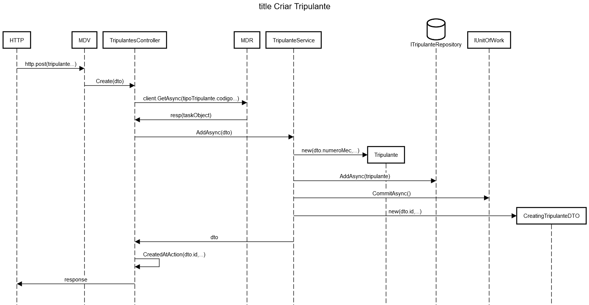
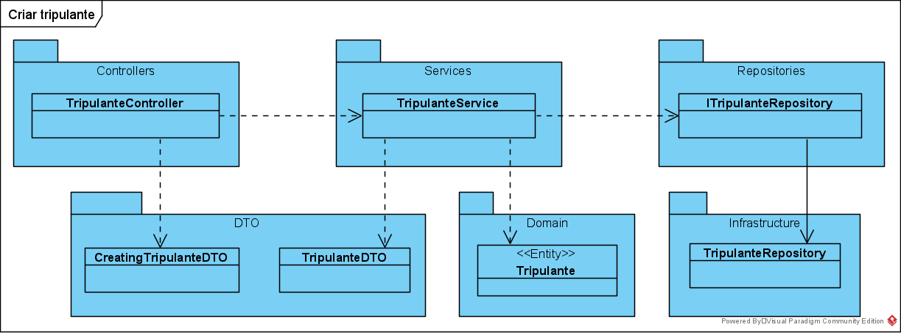

**US41 - Definir tripulante** *(requisito nº 12)*
=======================================

# 1. Requisitos

**US41** - Como data administrator, quero definir tripulante (nome, data de nascimento, número de carta de condução, data de validade de licença de condução) associando um ou mais tipos de tripulante.

> _A implementação desta user story não requer uma divisão em mais casos de uso._

# 2. Análise

O **Tripulante** trata-se do colaborador da empresa que desempenha funções de motorista.

## 2.1. Glossário de conceitos e Contexto
* **Data Administrator**: utilizador da user story. Responsável por aceder ao sistema para definir um tripulante.
* **Tripulante**: motorista.

## 2.1.1. Caracterização de Tipo de Tripulante:
* **Número Mecanográfico**;
* **Nome**;
* **Data de Nascimento**;
* **Número de Cartão de Cidadão**;
* **NIF**;
* **Número da Carta de Condução**;
* **Data de Emissão da Licença de Condução**;
* **Data de Validade da Licença de Condução**;
* **Tipo de Tripulante**;
* **Data de Entrada na Empresa**;
* **Data de Saída da Empresa**.

## 2.2. Regras de negócio / Outros requisitos

Um tripulante tem um **número mecanográfico (sequência alfanumérica de 9 caracteres)** e outros atributos sem uma regra ou requisito especificado pelo cliente, mas com regras já definidas por natureza.
Por exemplo, a data de saída não pode ser inferior à data de entrada.

|  |  |
|---------|---------|
| **NIF** | Sequência de 9 algarismos |
| **Nº Cartão Cidadão** | Constituído por uma sequência de 3 elementos distintos: |
| | - 10 algarismos |
| | - 2 caracteres alfanuméricos |
| | - 1 algarismo |
| **Nº Carta Condução** | Composto por uma sequência de algarismos precedido dos dígitos alfabéticos identificadores do serviço emissor da carta |
| | |

# 3. Design

Implementação de acordo com a estrutura base da aplicação.

## 3.1. Realização da Funcionalidade

O fluxo que permite realizar esta funcionalidade pode ser descrito através do diagrama seguinte:

[Raw file](./US41_SD.md)

### 3.1.1. **Classes correspondentes a entidades do domínio**:

Entidade Tripulante

|**Entity** |**Value Object**  |
|---------|---------|
| Tripulante | NumeroMecanograficoTripulante |
|    | NIFtripulante |
|    | NumeroCartaoCidadaoTripulante |
|    | NumeroCartaConducaoTripulante |
| TipoTripulante | CodigoTipoTripulante |
| | |

## 3.2. Diagrama de Classes

## 3.3. Padrões Aplicados

Padrões já definidos no 2. do [Readme](../../README.md), em _Aspetos Gerais, Arquitetura e Design do Sistema_.

## 3.4. Testes

### 3.4.1. Testes Unitários

* Testar tamanho do número mecanográfico, sequência alfanumérica de 9 caracteres.
* Testar a funcionalidade de cada método principal (Create, AddAsync, entre outros).

### 3.4.2. Testes de Integração

* Controller -> Service -> Repository

## 3.4.3. Testes e2e

* POST -> criar um tipo de tripulante
* GET -> listar um tipo de tripulante
* UPDATE -> alterar um tipo de tripulante
* DELETE -> apagar um tipo de tripulante

> Plataforma utilizada no MDV: Postman

> Plataforma utilizada no SPA: Cypress

# 4. Integração/Demonstração

Realizar testes unitários, de integração e e2e em conformidade.

Módulo Master Data Viagem - Integração no sistema OPT:

* [SPA](https://bitbucket.org/pvpmagalhaes1/20s5-3na-2spa/src/master)

* [Master Data Rede](https://bitbucket.org/pvpmagalhaes1/20s5_3na_2/src/master/)

* [Planeamento](https://bitbucket.org/pvpmagalhaes1/20s5_3na_2/src/master/Planeamento/)

# 5. Observações

Juntamente com as viaturas, os tripulantes são necessários ter em conta no planeamento e gestão da rede.

### [**Voltar para o Índice de User Stories**](../us.md)
