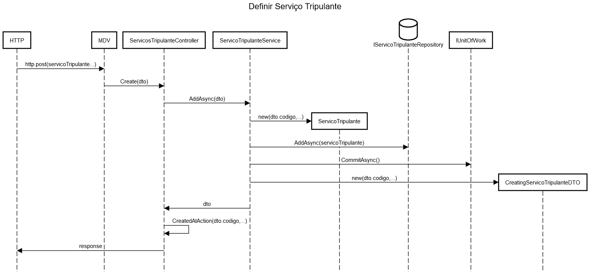
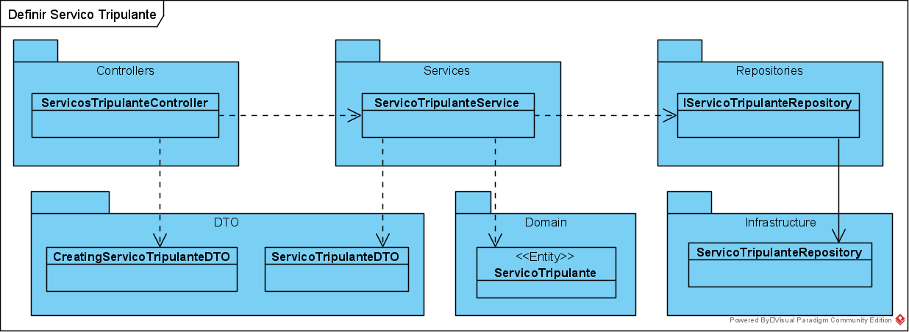

**US61 - Criar Serviço de Tripulante ad hoc**
=======================================

# 1. Requisito nº 16

**US61** - Como data administrator quero criar um serviço de tripulante ad hoc.

> _A implementação desta user story não requer uma divisão em mais casos de uso._

# 2. Análise

**Serviço de Tripulante no contexto de bloco de trabalho e a relação com o serviço de viatura**:

* Caderno de encargos, página 6:

> "_No exemplo da Figura 6, a linha Paredes-Aguiar terá várias viagens ao longo do dia para as quais foi planeado o serviço de viatura "V 12" atendendo às diversas restrições do sistema. Como essa linha tem viagens ao longo do dia não será possível um único motorista efetuar todas as viagens pelo que o serviço da viatura será divido em blocos de trabalho que serão atribuídos a serviços de tripulantes. No exemplo da figura, os três primeiros blocos do serviço de viatura são atribuídos ao serviço de tripulante "5188", os próximos dois blocos ao serviço de tripulante "276", etc._"

* Enquadramento:

> "_... é necessário dividir cada serviço de viatura em blocos de trabalho para os tripulantes. Devido aos acordos
laborais existem tempos máximos de trabalho para os tripulantes pelo que os blocos de trabalho têm que estar de acordo com essas regras. Um serviço de viatura pode ter 3 blocos de trabalho de 2 horas cada, mas no exemplo, seriam necessários dois tripulantes: A para os 2 primeiros e B para o último bloco de trabalho deste serviço._" - [Moodle Fórum](https://moodle.isep.ipp.pt/mod/forum/discuss.php?d=2852#p3794)

* Sequência natural:

> 1. definir viagens
> 2. definir serviços de viatura para essas viagens
> 3. definir blocos de trabalho para esse serviços de viatura
> 4. definir serviços de tripulante com base nesses blocos de trabalho

[Fonte](https://moodle.isep.ipp.pt/mod/forum/discuss.php?d=3187#p4221)
 
* Outro exemplo: [Associação blocos de trabalho, serviços de viagens e serviços de tripulantes](https://moodle.isep.ipp.pt/mod/forum/discuss.php?d=3577)

**Outras notas Módulo Planeamento**:

* O tripulante pode terminar o seu serviço durante uma viagem;
* As trocas de tripulante ocorrem em pontos de rendição ou estações de recolha;
* Normalmente, as trocas coincidem com o início/fim do serviço de tripulante.

[Fonte](https://moodle.isep.ipp.pt/mod/forum/discuss.php?d=657)

## 2.1. Glossário de conceitos e Contexto

* **Serviço de Tripulante**: corresponde ao período diário de trabalho de um tripulante. Um serviço é definido como uma sequência de blocos de trabalho obedecendo a um conjunto de regras.
* **Data Administrator**: utilizador da user story. Responsável por aceder ao sistema para criar um serviço de tripulante ad hoc.

## 2.1.1. Caracterização do Serviço de Tripulante:

* **Código (alfanumérico)**
    * Relação com um conjunto de blocos de trabalho

[Moodle Fórum](https://moodle.isep.ipp.pt/mod/forum/discuss.php?d=2727#p3633)

## 2.2. Regras de negócio / Outros requisitos

|  |  |
|---------|---------|
| **Código** | Alfanumérico de 10 caracteres |
| **Bloco de Trabalho** | O serviço de tripulante está relacionado com um conjunto de blocos de trabalho |
| | |

**Notas Módulo Planeamento**:

* Também tem uma duração máxima de 8 horas (parametrizável no sistema) e uma pausa obrigatória depois de 4 horas ininterruptas de serviço.

* A duração do serviço de tripulante corresponde à duração dos blocos associados (que devem ser contínuos em cada período).

> [Moodle Fórum](https://moodle.isep.ipp.pt/mod/forum/discuss.php?d=2727#p3633)

### 2.2.1. Estrutura no Ficheiro

```xml
<DriverDuty key="DriverDuty:1" Name="276" Color="RGB(172,229,238)" DriverDutyType="DriverDutyType:2">
    <WorkBlocks>
        <ref key="WorkBlock:2" />
        <ref key="WorkBlock:39" />
        <ref key="WorkBlock:40" />
        <ref key="WorkBlock:41" />
        <ref key="WorkBlock:42" />
        <ref key="WorkBlock:213" />
        <ref key="WorkBlock:214" />
    </WorkBlocks>
    <Runs />
    <ParametersValues />
</DriverDuty>
```

**Nota**: O elemento **DriverDutyType** pode ser ignorado -> [Moodle Fórum](https://moodle.isep.ipp.pt/mod/forum/discuss.php?d=3524#p4732)

# 3. Design

Implementação de acordo com a estrutura base do módulo MDV.

## 3.1. Realização da Funcionalidade

O fluxo que permite realizar esta funcionalidade pode ser descrito através do diagrama seguinte:


[Raw file](./US61_SD.md)

### 3.1.1. **Classes correspondentes a entidades do domínio**:

Entidade Tripulante

|**Entity** |**Value Object**  |
|---------|---------|
| ServicoTripulante | CodigoServicoTripulante |
| | |

## 3.2. Diagrama de Classes



## 3.3. Padrões Aplicados

Padrões já definidos no 2. do [Readme](../../README.md), em _Aspetos Gerais, Arquitetura e Design do Sistema_.

## 3.4. Planeamento de testes

### 3.4.1. Testes Unitários

* Testar os requisitos do código: alfanumérico de 10 caracteres.
* Testar a funcionalidade de cada método principal (Create, AddAsync, entre outros).

### 3.4.2. Testes de Integração

* Controller -> Service -> Repository

## 3.4.3. Testes e2e

* POST -> criar um serviço de tripulante

> Plataforma utilizada no MDV: Postman

> Plataforma utilizada no SPA: Cypress

# 4. Integração/Demonstração

Realizar testes de integração e e2e em conformidade.

Módulo Master Data Viagem - Integração no sistema:

* [SPA](https://bitbucket.org/pvpmagalhaes1/20s5-3na-2spa/src/master)

* [Planeamento](https://bitbucket.org/pvpmagalhaes1/20s5_3na_2/src/master/Planeamento/)

# 5. Observações

Juntamente com serviço de viatura e blocos de trabalho, o serviço de tripulante é necessário para concretizar o planeamento e gestão da rede.

### [**Voltar para o Índice de User Stories**](../us.md)
