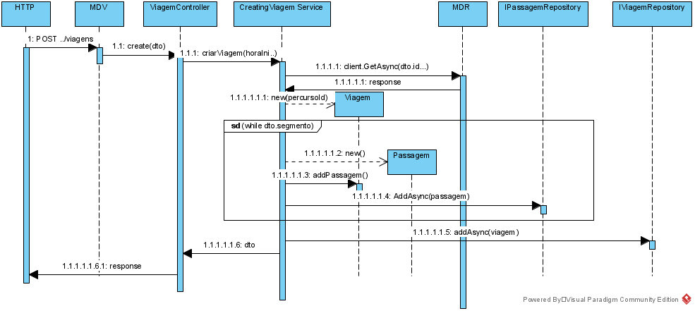
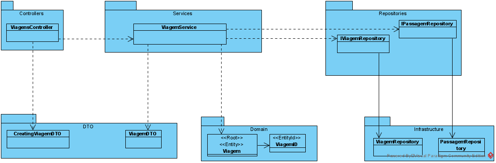

**US_MDV_60 - Como data admnistrator quero criar as viagens**
=============================================================

# 1. Requisitos

**US_MDV_60** Como data admnistrator quero criar as viagens para uma linha dando a hora de início, a frequência e o número de viagens, o percurso de ida e o de volta.

## 1.1 Requisitos adicionais do cliente

* O utilizador deve criar uma viagem indicando o percurso de ida e percurso de volt, a frequência e o némero de viagens, com base nos segmentos desse percurso.
* Uma passagem  é criada no momento com base na informacão do percurso obtida pela MDR API, com base nos segmentos associados ao percurso.
* A validação a implementar é que o nó origem de um passagem seja o nó de destino do passagem anterior.
	- ex: numa linha com uma viagem A -> B -> C -> D existirão 3 passagens (A-B, B-C e C-D).
* O tempo da hora inicial e hora final são construidos tendo por base a duracao de cada segmento de cada percurso.
* A descricao da viagem é construída com a informação do nó inicial da viagem, o nó final da viagem e o tempo inicial
	- ex: "PARED-AGUIA@39600"

# 2. Análise

## 2.1. Glossário de conceitos

* **Data Administrator**: utilizador do caso de uso. É ele o responsável por definir um percurso no sistema.
* **Viagem**: trajeto correspondendo a uma sequência de nós com tempos definido.
* **Linha**: conjunto de percursos. Uma linha terá, pelo menos, dois percursos em sentidos opostos. Por vezes poderá ter percursos alternativos que permitem reforçar a oferta em algumas das áreas cobertas pela linha.
* **Nó**: ponto da rede de transportes com importância para o processo de planeamento. Exemplos de nós são estações de recolha, términos, e paragens ao público.
* **Segmento**: ligação direta entre dois nós, ex, Paredes-Cete.
* **Passagem**: ligação direta entre dois nós, com informação da hora e nó iniciais e hora e nós finais.

## 2.1.1. Caracterização de Tipo de Tripulante:
* **Id**;
* **PercursoId**;
* **ServicoViaturaId**;
* **HoraInicio**;
* **HoraFim**;
* **Descritivo**;

## 2.2. Modelo de domínio

Classes correspondentes a entidades do domínio:
* **Percurso**(aggregate root - Percurso)
* **Segmento**
* **Linha** (aggregate root - Linha)
* **Nó** (aggregate root - Nó)
* **Viagens** (aggregate root - Viagem)
* **Passagens** (aggregate root - Passagem)

## 2.3. Regras de negócio

# 3. Design

## 3.1. Realização da Funcionalidade
O fluxo que permite realizar esta funcionalidade pode ser descrito através do diagrama seguinte:

## 3.2. Diagrama de Classes

## 3.3. Padrões Aplicados

Os padrões utilizados podem ser enquadrados nos seguintes:
* GRASP: Controller, Creator, Information Expert, High Cohesion, Low Coupling
* SOLID: Single-responsibility principle

## 3.4. Testes

# 4. Implementação

# 5. Integração/Demonstração

# 6. Observações
