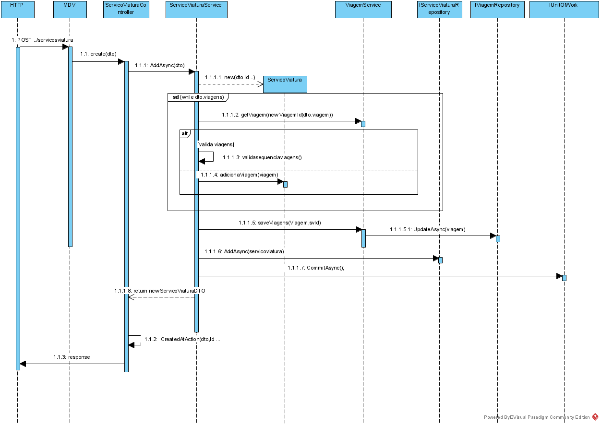
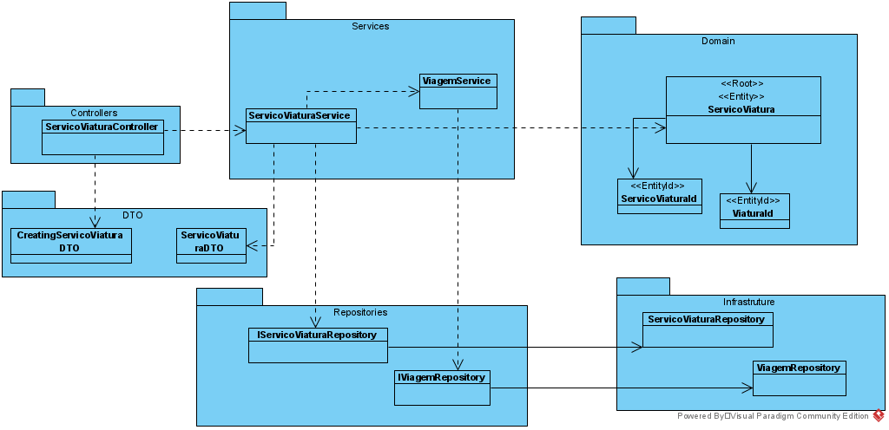

**US60 - [MDV] Como data administrator quero criar um serviço de viatura ad hoc**
=======================================

# 1. Requisitos

**US_MDV_60** - Como data administrator quero criar um serviço de viatura ad hoc

## 1.1 Requisitos adicionais do cliente

* `Os serviços de viatura e os serviços de tripulante não são escalonamento para dias concretos, por isso não possuem data.`

* `Como já referido mais que uma vez, serviço de viatura não tem associação com viatura e o serviço de tripulante não tem associação com tripulante`

* `notem que as viagens escolhidas para um serviço de viatura não podem ter sobreposições`

# 2. Análise

## 2.1. Glossário de conceitos

* **Data Administrator**: utilizador do caso de uso. É ele o responsável por definir um percurso no sistema.
* **Bloco**: .
* **ServicoViatura**: Um serviço de viatura corresponde ao período de trabalho diário de uma viatura. Um serviço é definido como uma sequência de blocos de trabalho obedecendo a um conjunto de regras. 
* **Viagem**: Uma viagem é a definição de horário do percurso. 

## 2.2. Modelo de domínio

Classes correspondentes a entidades do domínio:
* **ServicoViatura**
	* Value objects relacionados:
		* Id

	

## 2.3. Regras de negócio

* Value objects:
	* Id : alfanumérico, tem de ser unico
	* Lista Viagens representa a lista de viagens associada ao servico de viatura
	* Lista Blocos representa a lista de blocos de trabalho associada a um determinado serviço
  
# 3. Design

## 3.1. Realização da Funcionalidade

* Verificar se as viagens associada ao serviço de viatura existem
* Verificar se as viagens associadas ao serviço possuem uma ordenação correta, i.e, se o nó onde a viagem começa é o final da anterior e se o tempo de viagem se inicia tem valor superior à viagem que termina
* Verificar se o servico de viatura para uma determinada viatura não ultrapassa as 24 horas

O fluxo que permite realizar esta funcionalidade pode ser descrito através do diagrama seguinte:

## 3.2. Diagrama de Classes

## 3.3. Padrões Aplicados

Os padrões utilizados podem ser enquadrados nos seguintes:
* GRASP: Controller, Creator, Information Expert, High Cohesion, Low Coupling
* SOLID: Single-responsibility principle

## 3.4. Testes

* Testes unitários realizados no jest.

### 3.4.1 Planeamento

# 4. Implementação

# 5. Integração/Demonstração

# 6. Observações
