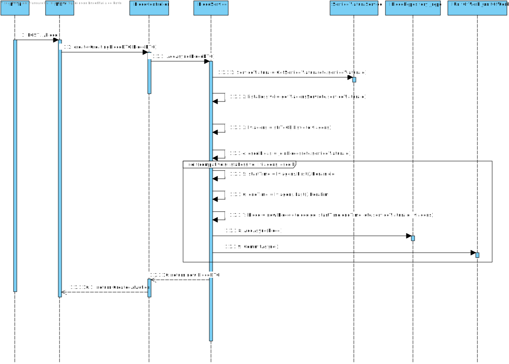
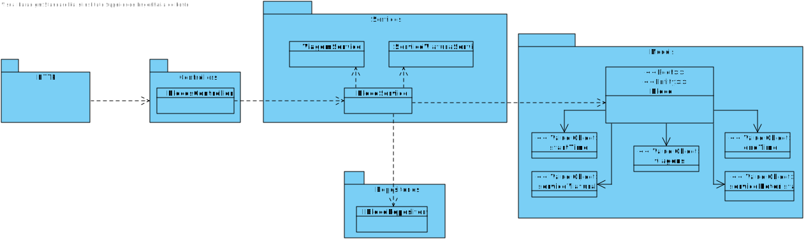

**US_MDV_43 - Como data administrator, quero criar bloco de trabalho.**
=======================================

# 1. Requisitos

**US_MDV_43** - Como data administrator, quero criar os blocos de trabalho de um serviço de viatura.

## 1.1 Requisitos adicionais do cliente

* `Necessarias viagens para definir serviços de viatura`
* `Necessarios serviços de viatura para caracterizar o bloco`

* `Um serviço de viatura “cumpre” uma ou mais viagens e normalmente está dividido em um ou mais blocos de trabalho`
* `numa primeira fase, os serviços de viaturas são criados para dar resposta às viagens. Numa segunda fase, os serviços de viatura são "divididos" em blocos de trabalho. claro está que esses blocos de trabalho vão cobrir as mesmas viagens indicadas na primeira fase` 

# 2. Análise

## 2.1. Glossário de conceitos

* **Data Administrator**: utilizador do caso de uso. É ele o responsável por definir um percurso no sistema.
* **Bloco**:  Um bloco de trabalho é um conjunto de viagens feitas, sem interrupções, pela mesma viatura, e com ou sem interrupções, pelo mesmo tripulante..
* **ServicoViatura**: Um serviço de viatura corresponde ao período de trabalho diário de uma viatura. Um serviço é definido como uma sequência de blocos de trabalho obedecendo a um conjunto de regras.. 
* **Viagem**: Uma viagem é a definição de horário do percurso. 

## 2.2. Modelo de domínio

Classes correspondentes a entidades do domínio:
* **Bloco**
	* Value objects relacionados:
		* Id
		* startTime
		* endTime
		* viagens(Lista)
		* ServicoViaturaId
		* ServicoMotoristaId

## 2.3. Regras de negócio

* Value objects:
	* Id : alfanumérico, tem de ser unico
	* startTime : numerico
	* endTime : numerico, tem de ser superior ao startTime  
	* viagens(Lista): viagens do bloco têm de pertencer a lista das viagens do serviço de viatura associado, viagens dos blocos não podem ser repetidas para outros blocos , viagens nao podem ter espaços temporais entre elas.
	* ServicoViaturaId: alfanumérico, diz respeito a um servico de viatura ja existente.
	* ServicoMotoristaId: alfanumérico, diz respeito a um servico de motorista ja existente.
  
# 3. Design

## 3.1. Realização da Funcionalidade

* Verificar se as viagens associadas ao bloco existem na lista de viagens do servico de viatura correspondente.
* Verificar se as viagens associadas ao bloco já nao pertencem a outro bloco ja existente.
* Verificar se o servico de viatura e as viagens passadas por parametro existem.
* verificar se as viagens associadas ao bloco se encontram seguidas e sem intervalo entre elas.

O fluxo que permite realizar esta funcionalidade pode ser descrito através do diagrama seguinte:

## 3.2. Diagrama de Classes

## 3.3. Padrões Aplicados

Os padrões utilizados podem ser enquadrados nos seguintes:
* GRASP: Controller, Creator, Information Expert, High Cohesion, Low Coupling
* SOLID: Single-responsibility principle

## 3.4. Testes

* Testes unitários realizados no jest.

### 3.4.1 Planeamento

# 4. Implementação

*Nesta secção a equipa deve providenciar, se necessário, algumas evidências de que a implementação está em conformidade com o design efetuado. Para além disso, deve mencionar/descrever a existência de outros ficheiros (e.g. de configuração) relevantes e destacar commits relevantes;*

*Recomenda-se que organize este conteúdo por subsecções.*

# 5. Integração/Demonstração

# 6. Observações
