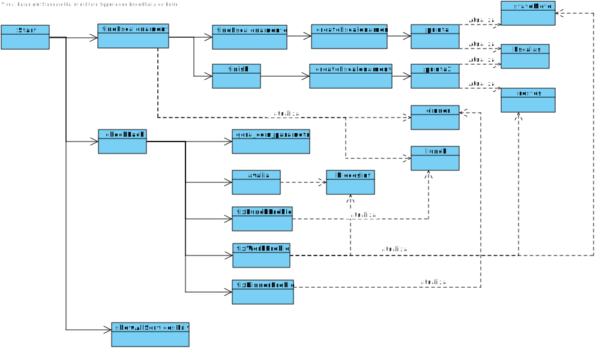

**US_Planeamento_80 - Afetacao de motoristas a autocarros**
=======================================

# 1. Requisitos

**US_Planeamento_80** - Como gestor pretendo afetar motoristas a servicos de viatura.

## 1.1 Requisitos adicionais do cliente

Ter as entidades necessarias ja inseridas no sistema.

# 2. Análise

## 2.1. Glossário de conceitos

* **Servico de Viatura**: Um serviço de viatura corresponde ao período de trabalho diário de uma viatura. Um serviço é definido como uma sequência de blocos de trabalho obedecendo a um conjunto de regras..
* **Motorista**: individuo que vai realizar a funcao de motorista

## 2.3. Regras de negócio

* O motorista nao pode trabalhar mais que 8 horas por dia
* O motorista nao pode trabalhar mais que 4 horas seguidas
* O motorista tem que ter pausa de almoco e jantar

# 3. Design

## 3.1. Realização da Funcionalidade

* Criar um escalonamento ideal.
* Correr o genetico com esse escalonamento e encontrar a melhor solucao.
* Avaliar a melhor solucao e verificar incumprimentos.
* Retificar os incumprimentos
* Realizar os passos anteriores para todos os servicos de viatura.

O fluxo que permite realizar esta funcionalidade pode ser descrito através do diagrama seguinte:

## 3.4. Testes

### 3.4.1 Planeamento

# 4. Implementação

*Nesta secção a equipa deve providenciar, se necessário, algumas evidências de que a implementação está em conformidade com o design efetuado. Para além disso, deve mencionar/descrever a existência de outros ficheiros (e.g. de configuração) relevantes e destacar commits relevantes;*

*Recomenda-se que organize este conteúdo por subsecções.*

# 5. Integração/Demonstração

# 6. Observações
