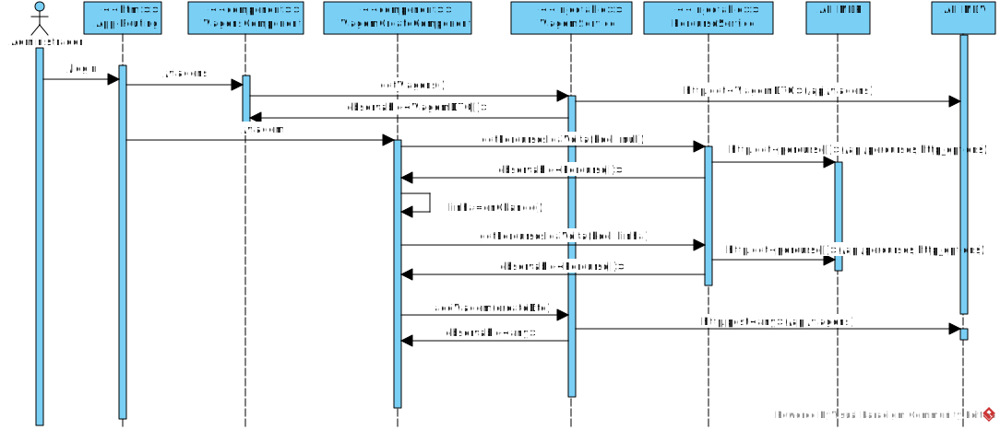

**US54 - [SPA] Criar uma viatura**
=======================================

# 1. Requisitos

Como data admnistrator quero criar as viagens para uma linha dando a hora de início, a frequência e o número de viagens, o percurso de ida e o de volta.

## 1.1 Requisitos adicionais do cliente

* o caso de uso "viagem ad hoc" cria viagens "normais", não existem viagens sem ser "normais". "ad hoc" neste caso pode ser entendido como "manualmente a pedido do utilizador" em vez de ser por um algoritmo de planeamento

# 2. Análise

## 2.1. Glossário de conceitos

* **Data Administrator**: utilizador do caso de uso. É ele o responsável por definir um percurso no sistema.
* **Nó**: ponto da rede de transportes com importância para o processo de planeamento. Exemplos de nós são estações de recolha, términos, e paragens ao público.
* **Viagem**: Uma viagem é a definição de horário do percurso.
* **Percurso** | Um percurso é um trajeto correspondendo a uma sequência de nós, ex., Paredes -> Cete -> Parada -> Recarei -> Aguiar. |

## 2.2. Modelo de domínio

## 2.3. Regras de negócio

# 3. Design

## 3.1. Realização da Funcionalidade

## 3.2. API call

### Criar Viagens

#### API MDV
* Endpoint:	`/api/viagens`
* Method: *POST*
* Body:
	* Media type: *application/json*
	* Type: *object*
	* Properties:
		* **HoraInicio**: number;
    * **PercursoId**: string;
    * **PercursoIdaId**: string;
    * **PercursoVoltaId**: string;
    * **Frequencia**: number;
    * **NViagens**: number;

#### API MDR
* Endpoint:	`/api/percursos`
* Method: *GET*
* Body:
	* Media type: *application/json*
	* Type: *object*
	* Properties:
		* **ida**: string (required)
		* **linha**: string (required)
	

## 3.3. Padrões Aplicados

## 3.4. Testes
Foram realizados testes unitários. Alguns exemplos aplicados:

	Em ViagemCreateComponent:
	it('create should call addPercurso', () => {
    component.create();
    expect(percursoService.addPercurso).toHaveBeenCalled(); }); 
		
	it('test create else statement', () => {
	spyOnConfirm.and.callThrough();
    spyOnConfirm.and.returnValue(false);
    component.create();
    expect(percursoService.addPercurso).toHaveBeenCalledTimes(0); });

	Em ViagemService:
	it('should addViagem using http request', () => {
    viagemService.addViagem(creatingViagemDTO).subscribe(res => expect(res).toEqual(creatingViagemDTO));
    expect(httpClientSpy.post).toHaveBeenCalled()});

	it('should getViagens using http request', () => {
    viagemService.getViagens();
    expect(httpClientSpy.get).toHaveBeenCalled();});

# 4. Implementação

# 5. Integração/Demonstração

# 6. Observações
