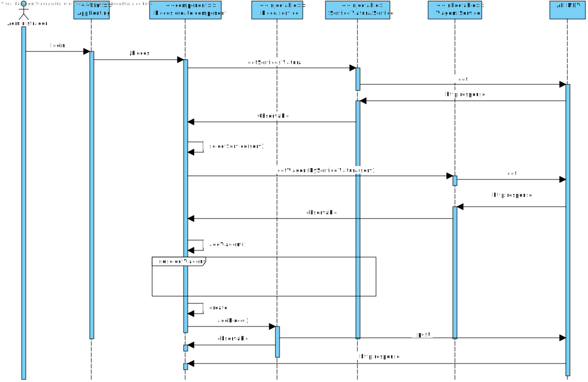

**US55 - Criar um bloco**
=======================================
`Como administrator quer criar um bloco de trabalho`
# 1. Requisitos

**US55** 

## 1.1 Requisitos adicionais do cliente

`Requisitos estão demonstrados no caso de uso respetivo na componente MDV`

# 2. Análise

O utilizador insere um codigo, escolhe o serviço de viatura a que o bloco vai estar referenciado, e escolhe as viagens que vai executar ( da lista de viagens do servico de viatura escolhido).

## 2.1. Glossário de conceitos

* **Data Administrator**: utilizador do caso de uso. É ele o responsável por definir um percurso no sistema.
* **Bloco**: ponto da rede de transportes com importância para o processo de planeamento. Exemplos de nós são estações de recolha, términos, e paragens ao público.

## 2.2. Modelo de domínio

## 2.3. Regras de negócio
As regras de negócio são implementadas do lado do servidor na aplicação de back-end.

# 3. Design

## 3.1. Realização da Funcionalidade

## 3.2. API call

### Criar Bloco

* Endpoint:	`/api/blocos`
* Method: *POST*
* Body:
	* Media type: *application/json*
	* Type: *object*
	* Properties:
		* **codigo**: string (required)
		* **servicoMotoristaId**: string (required)
		* **startTime**: number (required)
		* **endTime**: number (required)
		* **viagens**: string[] (required)

### Listar Servicos Viatura

* Endpoint:	`/api/servicosviatura`
* Method: *GET*
* Body:
	* Media type: *application/json*
	* Type: *object*
	* Properties:
		* **abreviatura**: string (required)
		* **nome**: string (required)
		* **latitude**: number (required)
		* **longitude**: number (required)
		* **estacaoRecolha**: boolean (required)
		* **pontoRendicao**: boolean (required)

### Listar Viagens por servico Viatura
* Endpoint:	`/api/viagens`
* Method: *GET*
* Body:
	* Media type: *application/json*
	* Type: *object*
	* Properties:
	  * **id**: string
  	* **percursoId**: string
    * **descritivo**: string
    * **horaInicio**: number
    * **horaFim**: number

## 3.3. Padrões Aplicados

## 3.4. Testes

# 4. Implementação

# 5. Integração/Demonstração

# 6. Observações
