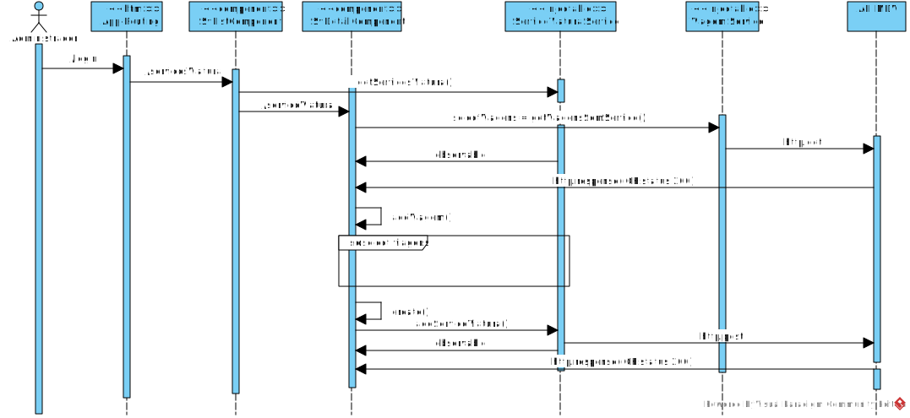

**US59 - criar um serviço de viatura ad hoc**
=======================================
Como data administrator quero criar um serviço de viatura ad hoc.

# 1. Requisitos

## 1.1 Requisitos adicionais do cliente

* `Os serviços de viatura e os serviços de tripulante não são escalonamento para dias concretos, por isso não possuem data.`

* `Como já referido mais que uma vez, serviço de viatura não tem associação com viatura e o serviço de tripulante não tem associação com tripulante`

* `notem que as viagens escolhidas para um serviço de viatura não podem ter sobreposições`

# 2. Análise

Ao utilizador mediante a selecão de "adicionar serviço", é pedido para inserir
um identificador único do serviço e a possibilidade tambem mediante selecao de viagens que ainda não tiveram serviço de viatura associadas.

## 2.1. Glossário de conceitos

* **Data Administrator**: utilizador do caso de uso. É ele o responsável por definir um percurso no sistema.
* **Serviço de Viatura**: Um serviço de viatura corresponde ao período de trabalho diário de uma viatura. Um serviço é definido como uma sequência de blocos de trabalho obedecendo a um conjunto de regras.
* **Viagem**: Uma viagem é a definição de horário do percurso. 

## 2.2. Modelo de domínio

## 2.3. Regras de negócio
As regras de negócio são implementadas do lado do servidor na aplicação de back-end.

# 3. Design

## 3.1. Realização da Funcionalidade

## 3.2. API call

### Criar Viatura

* Endpoint:	`/api/servicosviatura`
* Method: *POST*
* Body:
	* Media type: *application/json*
	* Type: *object*
	* Properties:
		* **abreviatura**: string (required)
		* **nome**: string (required)
		* **latitude**: number (required)
		* **longitude**: number (required)
		* **estacaoRecolha**: boolean (required)
		* **pontoRendicao**: boolean (required)

### Listar Viagens
* Endpoint:	`/api/viagens/semservico`
* Method: *GET*
* Body:
	* Media type: *application/json*
	* Type: *object*
	* Properties:
	  * **id**: string
  	* **percursoId**: string
    * **descritivo**: string
    * **horaInicio**: number
    * **horaFim**: number

## 3.3. Padrões Aplicados

## 3.4. Testes
São realizados testes unitários aos metodos. Alguns exemplos:

	it('getServicoViatura should call get getServicosViatura', () => {
    component.getServicosViatura();
    expect(servicoServicoViatura.getServicoViaturas).toHaveBeenCalled();
  });

	it('should create', () => {
    expect(component).toBeTruthy();
  });

# 4. Implementação

# 5. Integração/Demonstração

# 6. Observações
